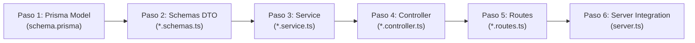

# Guía del Desarrollador Backend — Sinergy

Esta guía es la referencia técnica definitiva para hacer crecer el backend de Sinergy. Está ordenada estrictamente por el **orden de creación de código** (orden de dependencias): desde el modelado en base de datos hasta el montaje en el servidor Express. Si sigues cada sección en orden, serás capaz de construir cualquier módulo nuevo sin errores de dependencia ni dudas técnicas.

---

## Tabla de Contenidos

- [1. Mapa Arquitectónico](#1-mapa-arquitectónico)
  - [1.1 Estructura de carpetas](#11-estructura-de-carpetas)
  - [1.2 Capa `src/core/` — Infraestructura transversal](#12-capa-srccore--infraestructura-transversal)
  - [1.3 Capa `src/modules/` — Funcionalidades de negocio](#13-capa-srcmodules--funcionalidades-de-negocio)
- [2. El Orden de Creación de un Módulo Backend](#2-el-orden-de-creación-de-un-módulo-backend)
- [3. Paso 1 — Modelado de Datos con Prisma (`schema.prisma` y `prisma.ts`)](#3-paso-1--modelado-de-datos-con-prisma-schemaprisma-y-prismats)
  - [3.1 Definir el modelo en `schema.prisma`](#31-definir-el-modelo-en-schemaprisma)
  - [3.2 Migrar y generar tipos Prisma](#32-migrar-y-generar-tipos-prisma)
  - [3.3 El singleton `prisma.ts`](#33-el-singleton-prismats)
- [4. Paso 2 — Schemas y DTOs (`*.schemas.ts`)](#4-paso-2--schemas-y-dtos-schemasts)
  - [4.1 Definir interfaces de entrada y salida](#41-definir-interfaces-de-entrada-y-salida)
- [5. Paso 3 — Lógica de Negocio y Servicio (`*.service.ts`)](#5-paso-3--lógica-de-negocio-y-servicio-servicets)
  - [5.1 Construcción del servicio singleton](#51-construcción-del-servicio-singleton)
- [6. Paso 4 — Controladores y Respuesta HTTP (`*.controller.ts`)](#6-paso-4--controladores-y-respuesta-http-controllerts)
  - [6.1 El contrato `ResponseDTO`](#61-el-contrato-responsedto)
  - [6.2 Tabla de códigos HTTP usados](#62-tabla-de-códigos-http-usados)
  - [6.3 Utilidades del Core (`parsearId`, `validarCodigo`, `capitalizarPalabras`, `constantes.ts`)](#63-utilidades-del-core-parsearid-validarcodigo-capitalizarpalabras-constantests)
  - [6.4 Manejo explícito de errores de Prisma](#64-manejo-explícito-de-errores-de-prisma)
  - [6.5 Patrón completo de un controlador](#65-patrón-completo-de-un-controlador)
- [7. Paso 5 — Rutas y Seguridad (`*.routes.ts`)](#7-paso-5--rutas-y-seguridad-routests)
  - [7.1 Definición de rutas y verbos HTTP](#71-definición-de-rutas-y-verbos-http)
  - [7.2 El middleware `validarJWT` y `req.usuario`](#72-el-middleware-validarjwt-y-requsuario)
- [8. Paso 6 — Montaje en el Servidor Express (`server.ts`)](#8-paso-6--montaje-en-el-servidor-express-serverts)
  - [8.1 Orden estricto de middlewares en `server.ts`](#81-orden-estricto-de-middlewares-en-serverts)
  - [8.2 Registrar el nuevo módulo](#82-registrar-el-nuevo-módulo)
- [9. Tutorial Completo Paso a Paso: Crear el Módulo `proveedores`](#9-tutorial-completo-paso-a-paso-crear-el-módulo-proveedores)
- [10. Tutorial: Agregar un Endpoint a un Módulo Existente](#10-tutorial-agregar-un-endpoint-a-un-módulo-existente)
- [11. Solución a Errores Comunes](#11-solución-a-errores-comunes)

---

## 1. Mapa Arquitectónico

### 1.1 Estructura de carpetas

```
apps/backend/
├── prisma/
│   └── schema.prisma          ← Definición de modelos de base de datos
└── src/
    ├── core/                  ← Infraestructura global (no toca negocio)
    │   ├── errors/
    │   │   └── AppError.ts        ← Clase de error tipado con statusCode
    │   ├── middlewares/
    │   │   ├── autenticar.ts      ← validarJWT: verifica el Bearer Token
    │   │   ├── errorHandler.ts    ← Captura global de errores no controlados
    │   │   ├── notFoundHandler.ts ← Respuesta 404 para rutas inexistentes
    │   │   └── refreshToken.ts    ← Lógica de refresco de sesión JWT
    │   ├── security/
    │   │   ├── jwt.ts             ← Firma y verificación de tokens JWT
    │   │   └── hashPassword.ts    ← Hash y comparación de contraseñas
    │   ├── types/
    │   │   ├── response.dto.ts    ← Interfaz ResponseDTO (contrato de respuesta)
    │   │   ├── auth.types.ts      ← Tipo del payload JWT decodificado
    │   │   └── express.d.ts       ← Extensión de tipos de Express (req.usuario)
    │   ├── utils/
    │   │   ├── capitalizar.ts         ← Primera letra en mayúscula
    │   │   ├── capitalizarPalabras.ts ← Capitalizar cada palabra de un string
    │   │   ├── constantes.ts          ← RegEx de dominio (códigos de planta, línea, etc.)
    │   │   ├── parsearId.ts           ← Parsear y validar IDs de URL (string → number|null)
    │   │   └── validarCodigo.ts       ← Validar un string contra una RegEx
    │   ├── prisma.ts          ← Instancia singleton de PrismaClient con driver pg
    │   └── server.ts          ← Configuración Express y montaje de módulos
    └── modules/               ← Funcionalidades de negocio
        ├── auth/
        ├── roles/
        ├── plantas/           ← Módulo de referencia de esta guía
        ├── ubicaciones/
        ├── lineas/
        ├── equipo/
        ├── componentes/
        └── mantenimiento/
```

### 1.2 Capa `src/core/` — Infraestructura transversal

Esta carpeta contiene **únicamente** código transversal a todos los módulos. Nunca pongas lógica de negocio aquí.

| Archivo | Propósito | Se importa en |
|---|---|---|
| `prisma.ts` | Instancia singleton de Prisma. Importar siempre desde aquí. | `*.service.ts` |
| `server.ts` | Configura Express y registra módulos con `app.use()`. | Solo en el montaje de módulos nuevos |
| `middlewares/autenticar.ts` | Verifica el JWT e inyecta `req.usuario`. | `*.routes.ts` de rutas privadas |
| `middlewares/errorHandler.ts` | Captura cualquier `next(error)` y responde en formato estándar. | Se registra al final de `server.ts` |
| `types/response.dto.ts` | Interfaz `ResponseDTO` para tipar las respuestas del controlador. | `*.controller.ts` |
| `utils/parsearId.ts` | Convierte `string` de `req.params.id` en `number \| null`. | `*.controller.ts` en rutas `/:id` |
| `utils/validarCodigo.ts` | Aplica una RegEx sobre un string. | `*.controller.ts` cuando hay formato de código |
| `utils/constantes.ts` | RegEx de los códigos del sistema. | `*.controller.ts` |

### 1.3 Capa `src/modules/` — Funcionalidades de negocio

Cada carpeta dentro de `modules/` representa un dominio de negocio aislado. Un módulo **siempre** tiene exactamente 4 archivos con la convención `<singular>.<capa>.ts`:

```
src/modules/plantas/
├── planta.schemas.ts     ← Contratos TypeScript (DTOs). Solo tipos, sin lógica.
├── planta.service.ts     ← Consultas a la base de datos con Prisma. Sin validaciones HTTP.
├── planta.controller.ts  ← Recepción HTTP, validaciones nativas y respuesta.
└── planta.routes.ts      ← Definición de endpoints y middlewares.
```

---

## 2. El Orden de Creación de un Módulo Backend

Para garantizar que el código compile siempre a medida que lo escribes y evitar referencias circulares o inexistentes, un módulo backend **debe crearse strictly en este orden**:



> **¿Por qué este orden?**
> - El **Service** requiere los **Schemas/DTOs** para tipar sus parámetros.
> - El **Controller** requiere el **Service** para invocar la base de datos.
> - Las **Routes** requieren los métodos del **Controller** para mapear los endpoints.
> - El **Server Express** requiere el archivo de **Routes** para hacer el `app.use()`.

---

## 3. Paso 1 — Modelado de Datos con Prisma (`schema.prisma` y `prisma.ts`)

### 3.1 Definir el modelo en `schema.prisma`

Antes de escribir cualquier TypeScript, la tabla debe existir en la base de datos a través de `apps/backend/prisma/schema.prisma`.

```prisma
model Planta {
  id            Int       @id @default(autoincrement()) // Clave primaria autoincremental
  codigo        String    @unique @db.VarChar(50)      // Código único de la planta (ej: "1000-EXT")
  nombre        String    @db.VarChar(255)             // Nombre descriptivo de la planta
  activa        Boolean   @default(true)               // Estado activo/inactivo (soporte para soft delete)
  creadoEn      DateTime  @default(now())  @map("creado_en")      // Timestamp de creación automática
  actualizadoEn DateTime  @updatedAt       @map("actualizado_en")  // Timestamp de actualización automática

  @@map("plantas") // Mapeo explícito al nombre de la tabla en la BD PostgreSQL
}
```

### 3.2 Migrar y generar tipos Prisma

Ejecuta la migración para crear la tabla y actualizar los tipos generados automáticamente en `@prisma/client`:

```powershell
# Crear y aplicar migración oficial
pnpm --filter @sinergy/backend exec prisma migrate dev --name crear_tabla_plantas
```

O para sincronización directa en entorno de desarrollo local sin historial de migraciones:
```powershell
# Sincronizar esquema directamente con la base de datos
pnpm --filter @sinergy/backend exec prisma db push
```

### 3.3 El singleton `prisma.ts`

Toda interacción con Prisma debe pasar por la instancia singleton exportada en `apps/backend/src/core/prisma.ts`. **Nunca crees una nueva instancia `new PrismaClient()` en un servicio.**

---

## 4. Paso 2 — Schemas y DTOs (`*.schemas.ts`)

### 4.1 Definir interfaces de entrada y salida

Define **únicamente interfaces TypeScript**. Sin lógica, sin funciones, sin clases. Su propósito es establecer el contrato de los datos que entran y salen del módulo.

**Patrón real del proyecto (`planta.schemas.ts`):**
```typescript
// apps/backend/src/modules/plantas/planta.schemas.ts

// DTO de creación: campos requeridos en el body del HTTP POST para registrar
export interface RegistrarPlantaDTO {
  codigo: string;   // Código único obligatorio
  nombre: string;   // Nombre de la planta obligatorio
  activa?: boolean; // Booleano opcional (si se omite, el controlador asigna true)
}

// DTO de edición: campos opcionales para el HTTP PATCH (el cliente envía solo lo que modifica)
export interface EditarPlantaDTO {
  codigo?: string;
  nombre?: string;
  activa?: boolean;
}

// DTO de parámetros de URL: para rutas con variables como /editar/:id o /eliminar/:id
export interface Params {
  id: string; // Express entrega todos los req.params como string
}
```

---

## 5. Paso 3 — Lógica de Negocio y Servicio (`*.service.ts`)

### 5.1 Construcción del servicio singleton

El servicio es una clase que encapsula **todas las consultas a Prisma**. No valida entradas HTTP ni construye respuestas HTTP. Solo recibe datos ya validados y opera sobre la base de datos.

**Patrón real del proyecto (`planta.service.ts`):**
```typescript
// apps/backend/src/modules/plantas/planta.service.ts
import prisma from '../../core/prisma' // Instancia singleton centralizada de PrismaClient
import { RegistrarPlantaDTO, EditarPlantaDTO } from './planta.schemas' // DTOs de entrada

class PlantaService {

    // Lectura: obtiene el listado completo de plantas desde PostgreSQL
    async obtener() {
        return prisma.planta.findMany()
    }

    // Escritura: crea un nuevo registro en la base de datos con los datos previamente validados
    async crearPlanta(datos: RegistrarPlantaDTO) {
        return prisma.planta.create({
            data: datos
        })
    }

    // Escritura: actualiza únicamente los campos presentes en el objeto `datos` para el ID dado
    async editarPlanta(datos: EditarPlantaDTO, id: number) {
        return prisma.planta.update({
            where: { id },
            data: datos
        })
    }

    // Escritura: realiza un borrado lógico (soft delete) marcando activa = false sin destruir el registro
    async eliminarPlanta(id: number) {
        return prisma.planta.update({
            where: { id },
            data: { activa: false }
        })
    }
}

// Exportar una única instancia singleton (no exportar la clase desinstanciada)
export const plantaService = new PlantaService()
```

---

## 6. Paso 4 — Controladores y Respuesta HTTP (`*.controller.ts`)

### 6.1 El contrato `ResponseDTO`

**Toda respuesta** del backend usa el mismo formato, definido en `src/core/types/response.dto.ts`:

```typescript
// apps/backend/src/core/types/response.dto.ts

// Contrato único de respuesta JSON para todas las peticiones del backend
export interface ResponseDTO {
    status: 'ok' | 'error' // Discriminador de éxito o falla
    message: string       // Mensaje descriptivo para notificaciones/logs
    data?: Object         // Payload de retorno opcional en caso de éxito
}
```

### 6.2 Tabla de códigos HTTP usados

| Situación | Código HTTP | `status` |
|---|---|---|
| Recurso encontrado / operación exitosa | `200 OK` | `"ok"` |
| Recurso creado exitosamente | `201 Created` | `"ok"` |
| Datos de entrada inválidos o faltantes | `400 Bad Request` | `"error"` |
| Token ausente, inválido o expirado | `401 Unauthorized` | `"error"` |
| Sin permisos para la acción | `403 Forbidden` | `"error"` |
| Recurso no encontrado (Prisma `P2025`) | `404 Not Found` | `"error"` |
| Conflicto de unicidad (Prisma `P2002`) | `409 Conflict` | `"error"` |
| Dependencia de clave foránea (Prisma `P2003`) | `409 Conflict` | `"error"` |
| Error inesperado del servidor | `500 Internal Server Error` | `"error"` |

### 6.3 Utilidades del Core (`parsearId`, `validarCodigo`, `capitalizarPalabras`, `constantes.ts`)

- `parsearId(req.params.id)`: Convierte `string` en `number | null` para prevenir NaN en consultas Prisma.
- `validarCodigo(codigo, REGEX)`: Valida la estructura del código contra expresiones regulares oficiales.
- `capitalizarPalabras(texto)`: Normaliza strings de usuario ("planta de mezcla" $\rightarrow$ "Planta De Mezcla").
- `constantes.ts`: Mantiene de manera centralizada las expresiones regulares del dominio.

### 6.4 Manejo explícito de errores de Prisma

| Código Prisma | Cuándo ocurre | Código HTTP | Mensaje Estándar |
|---|---|---|---|
| `P2002` | Violación de restricción `@unique` | `409 Conflict` | `"Ya existe un [recurso] con ese [campo]"` |
| `P2025` | Registro no encontrado en update/delete | `404 Not Found` | `"El [recurso] con ID X no existe"` |
| `P2003` | Violación de clave foránea | `409 Conflict` | `"No se puede eliminar el [recurso] porque tiene registros dependientes"` |

### 6.5 Patrón completo de un controlador

```typescript
// apps/backend/src/modules/plantas/planta.controller.ts
import { Request, Response, NextFunction } from 'express';
import { Prisma } from '@prisma/client'
import { plantaService } from './planta.service' // Invocación de la capa de servicio
import { ResponseDTO } from '../../core/types/response.dto'; // Contrato estandarizado HTTP
import { RegistrarPlantaDTO, EditarPlantaDTO } from './planta.schemas'; // DTOs de entrada
import { capitalizarPalabras } from '../../core/utils/capitalizarPalabras'
import { parsearId } from '../../core/utils/parsearId'
import { FORMATO_CODIGO_PLANTA } from '../../core/utils/constantes'
import { validarCodigo } from '../../core/utils/validarCodigo'

export const plantaController = {

    // GET /api/plantas/listar — Retorna la lista de plantas
    async verPlantas(req: Request, res: Response<ResponseDTO>, next: NextFunction) {
        try {
            const plantas = await plantaService.obtener()
            
            // Retornar 404 si la colección está vacía
            if (plantas.length === 0) {
                return res.status(404).json({ status: 'error', message: 'No hay plantas registradas' })
            }
            
            // Retornar 200 OK con los datos
            return res.status(200).json({ status: 'ok', message: 'Listado de plantas', data: plantas })
        } catch (error) {
            next(error) // Delegar error no controlado al middleware global
        }
    },

    // POST /api/plantas/crear — Valida y registra una nueva planta
    async registrarPlanta(req: Request<{}, {}, RegistrarPlantaDTO>, res: Response<ResponseDTO>, next: NextFunction) {
        try {
            const { codigo, nombre, activa } = req.body

            // 1. Validar formato de código mediante Expresión Regular de dominio
            if (!validarCodigo(codigo, FORMATO_CODIGO_PLANTA)) {
                return res.status(400).json({
                    status: 'error',
                    message: 'El código de la planta es inválido o no cumple con el formato requerido. Ej: "1000-EXT"'
                })
            }

            // 2. Validar presencia y tipo estricto del código
            if (!codigo || typeof codigo !== 'string' || !codigo.trim()) {
                return res.status(400).json({ status: 'error', message: 'El código de la planta es requerido y debe ser texto' })
            }

            // 3. Validar longitud máxima según la columna de BD (VarChar 50)
            if (codigo.trim().length > 50) {
                return res.status(400).json({ status: 'error', message: 'El código no puede superar los 50 caracteres' })
            }

            // 4. Validar presencia y tipo estricto del nombre
            if (!nombre || typeof nombre !== 'string' || !nombre.trim()) {
                return res.status(400).json({ status: 'error', message: 'El nombre de la planta es requerido y debe ser texto' })
            }

            if (nombre.trim().length > 255) {
                return res.status(400).json({ status: 'error', message: 'El nombre no puede superar los 255 caracteres' })
            }

            // 5. Validar tipo booleano si fue proporcionado
            if (activa !== undefined && typeof activa !== 'boolean') {
                return res.status(400).json({ status: 'error', message: 'El estado activo debe ser un valor booleano' })
            }

            // 6. Sanitizar datos: Mayúsculas en código, capitalización de palabras en nombre
            const nuevaPlanta: RegistrarPlantaDTO = {
                codigo: codigo.trim().toUpperCase(),
                nombre: capitalizarPalabras(nombre.trim()),
                activa: activa !== undefined ? activa : true // Valor por defecto true
            }

            // 7. Invocar servicio para persistir en BD
            const plantaRegistrada = await plantaService.crearPlanta(nuevaPlanta)

            // 8. Responder 201 Created con el nuevo recurso
            return res.status(201).json({
                status: 'ok',
                message: 'Planta registrada correctamente',
                data: plantaRegistrada
            })

        } catch (error: unknown) {
            // Capturar violación de unicidad de Prisma (P2002) y responder 409 Conflict
            if (error instanceof Prisma.PrismaClientKnownRequestError && error.code === 'P2002') {
                const target = (error.meta?.target as string[]) || []
                const campo = target.includes('codigo') ? 'código' : target.includes('nombre') ? 'nombre' : 'código o nombre'

                return res.status(409).json({
                    status: 'error',
                    message: `Ya existe una planta con ese ${campo}`
                })
            }
            next(error) // Delegar otros errores inesperados
        }
    },

    // PATCH /api/plantas/editar/:id — Actualización parcial de planta
    async actualizarPlanta(req: Request<any, {}, EditarPlantaDTO>, res: Response<ResponseDTO>, next: NextFunction) {
        try {
            // Parsear y validar que :id sea un entero numérico válido
            const id = parsearId(req.params.id)

            if (id === null) {
                return res.status(400).json({ status: 'error', message: 'El ID proporcionado debe ser un número válido' })
            }

            // Verificar que al menos un campo venga en el body
            if (Object.keys(req.body).length === 0) {
                return res.status(400).json({ status: 'error', message: 'Debe proporcionar al menos un campo para actualizar' })
            }

            const { codigo, nombre, activa } = req.body
            const datosActualizados: EditarPlantaDTO = {}

            // Sanitización y validación condicional campo por campo
            if (codigo !== undefined) {
                if (!validarCodigo(codigo, FORMATO_CODIGO_PLANTA)) {
                    return res.status(400).json({ status: 'error', message: 'El código de la planta es inválido' })
                }
                datosActualizados.codigo = codigo.trim().toUpperCase()
            }

            if (nombre !== undefined) {
                if (typeof nombre !== 'string' || !nombre.trim()) {
                    return res.status(400).json({ status: 'error', message: 'El nombre de la planta es inválido' })
                }
                datosActualizados.nombre = capitalizarPalabras(nombre.trim())
            }

            if (activa !== undefined) {
                if (typeof activa !== 'boolean') {
                    return res.status(400).json({ status: 'error', message: 'El estado activo debe ser un valor booleano' })
                }
                datosActualizados.activa = activa
            }

            const plantaActualizada = await plantaService.editarPlanta(datosActualizados, id)

            return res.status(200).json({
                status: 'ok',
                message: 'Planta actualizada correctamente',
                data: plantaActualizada
            })

        } catch (error: unknown) {
            if (error instanceof Prisma.PrismaClientKnownRequestError) {
                if (error.code === 'P2025') {
                    return res.status(404).json({ status: 'error', message: `La planta con ID ${req.params.id} no existe` })
                }
                if (error.code === 'P2002') {
                    return res.status(409).json({ status: 'error', message: 'Ya existe otra planta con ese código o nombre' })
                }
            }
            next(error)
        }
    },

    // DELETE /api/plantas/eliminar/:id — Borrado lógico (soft delete)
    async eliminarPlanta(req: Request, res: Response<ResponseDTO>, next: NextFunction) {
        try {
            const id = parsearId(req.params.id)

            if (id === null) {
                return res.status(400).json({ status: 'error', message: 'El ID proporcionado debe ser un número válido' })
            }

            const plantaEliminada = await plantaService.eliminarPlanta(id)

            return res.status(200).json({
                status: 'ok',
                message: 'Planta eliminada correctamente',
                data: plantaEliminada
            })

        } catch (error: unknown) {
            if (error instanceof Prisma.PrismaClientKnownRequestError) {
                if (error.code === 'P2025') {
                    return res.status(404).json({ status: 'error', message: `La planta con ID ${req.params.id} no existe` })
                }
                if (error.code === 'P2003') {
                    return res.status(409).json({
                        status: 'error',
                        message: 'No se puede eliminar la planta porque tiene líneas o ubicaciones asociadas. Desactívala en su lugar.'
                    })
                }
            }
            next(error)
        }
    }
}
```

---

## 7. Paso 5 — Rutas y Seguridad (`*.routes.ts`)

### 7.1 Definición de rutas y verbos HTTP

El archivo de rutas mapea verbos HTTP a métodos del controlador y aplica el middleware de seguridad.

**Patrón real del proyecto (`planta.routes.ts`):**
```typescript
// apps/backend/src/modules/plantas/planta.routes.ts
import { Router } from 'express'
import { plantaController } from './planta.controller' // Métodos del controlador
import { validarJWT } from '../../core/middlewares/autenticar' // Middleware de seguridad JWT

const router = Router()

// Mapear verbos HTTP. Usar arrays ['/path', '/path/'] para soportar opcionalmente la barra final
router.get(['/listar', '/listar/'], validarJWT, plantaController.verPlantas)
router.post(['/crear', '/crear/'], validarJWT, plantaController.registrarPlanta)
router.patch('/editar/:id', validarJWT, plantaController.actualizarPlanta)
router.delete('/eliminar/:id', validarJWT, plantaController.eliminarPlanta)

export default router
```

### 7.2 El middleware `validarJWT` y `req.usuario`

`validarJWT` verifica la validez del Access Token. Si es correcto, inyecta `req.usuario`. Todos los controladores pueden acceder a `req.usuario.id` y `req.usuario.roles`.

---

## 8. Paso 6 — Montaje en el Servidor Express (`server.ts`)

### 8.1 Orden estricto de middlewares en `server.ts`

El orden en `apps/backend/src/core/server.ts` es obligatorio:

```typescript
// apps/backend/src/core/server.ts

// 1. Seguridad y parsers globales (SIEMPRE PRIMERO)
app.use(helmet())       // Headers de seguridad HTTP
app.use(cors({ ... }))  // Configuración CORS con credenciales habilitadas
app.use(express.json()) // Parser de body JSON
app.use(cookieParser()) // Parser de cookies para refresh token

// 2. Rutas públicas de diagnóstico
app.get('/api/health', ...)

// 3. Módulos de negocio (AQUÍ SE REGISTRA TU MÓDULO NUEVO)
app.use('/api/auth', authRoutes)
app.use('/api/plantas', plantaRoutes)
app.use('/api/proveedores', proveedorRoutes) // ← Nuevo módulo registrado

// 4. Handlers globales de error (SIEMPRE AL FINAL, EN ESTE ORDEN)
app.use(notFoundHandler) // Captura 404 de rutas no existentes
app.use(errorHandler)    // Captura centralizada de exceptions con next(error)
```

### 8.2 Registrar el nuevo módulo

Para activar el nuevo módulo, agrega dos líneas en `server.ts`:
1. El import del router: `import proveedorRoutes from '../modules/proveedores/proveedor.routes'`
2. El montaje: `app.use('/api/proveedores', proveedorRoutes)`

---

## 9. Tutorial Completo Paso a Paso: Crear el Módulo `proveedores`

A continuación se muestra la creación completa del módulo `proveedores` siguiendo estrictamente el orden 1 $\rightarrow$ 6 con comentarios explicativos en cada bloque:

### Paso 1: `schema.prisma`
```prisma
// Definición del modelo Proveedor en apps/backend/prisma/schema.prisma
model Proveedor {
  id            Int       @id @default(autoincrement()) // Clave primaria
  codigo        String    @unique @db.VarChar(20)      // Código único de proveedor
  nombre        String    @db.VarChar(255)             // Nombre comercial
  contacto      String?   @db.VarChar(150)             // Campo opcional de contacto
  activo        Boolean   @default(true)               // Estado activo
  creadoEn      DateTime  @default(now())  @map("creado_en")
  actualizadoEn DateTime  @updatedAt       @map("actualizado_en")

  @@map("proveedores") // Nombre de la tabla PostgreSQL
}
```
Ejecutar en terminal: `pnpm --filter @sinergy/backend exec prisma db push`

### Paso 2: `proveedor.schemas.ts`
```typescript
// Contratos DTO en apps/backend/src/modules/proveedores/proveedor.schemas.ts

// DTO para el body de creación (POST)
export interface RegistrarProveedorDTO {
  codigo: string;
  nombre: string;
  contacto?: string | null;
  activo?: boolean;
}

// DTO para el body de edición (PATCH)
export interface EditarProveedorDTO {
  nombre?: string;
  contacto?: string | null;
  activo?: boolean;
}
```

### Paso 3: `proveedor.service.ts`
```typescript
// Capa de servicio en apps/backend/src/modules/proveedores/proveedor.service.ts
import prisma from '../../core/prisma' // Instancia singleton de PrismaClient
import { RegistrarProveedorDTO, EditarProveedorDTO } from './proveedor.schemas'

class ProveedorService {
    // Consulta lista ordenada alfabéticamente
    async obtener() {
        return prisma.proveedor.findMany({ orderBy: { nombre: 'asc' } })
    }

    // Insertar nuevo proveedor
    async crearProveedor(datos: RegistrarProveedorDTO) {
        return prisma.proveedor.create({ data: datos })
    }

    // Actualizar proveedor por ID
    async editarProveedor(datos: EditarProveedorDTO, id: number) {
        return prisma.proveedor.update({ where: { id }, data: datos })
    }

    // Borrado lógico (activo = false)
    async eliminarProveedor(id: number) {
        return prisma.proveedor.update({ where: { id }, data: { activo: false } })
    }
}

export const proveedorService = new ProveedorService() // Exportar instancia única
```

### Paso 4: `proveedor.controller.ts`
```typescript
// Capa de controlador HTTP en apps/backend/src/modules/proveedores/proveedor.controller.ts
import { Request, Response, NextFunction } from 'express';
import { Prisma } from '@prisma/client'
import { proveedorService } from './proveedor.service'
import { ResponseDTO } from '../../core/types/response.dto';
import { RegistrarProveedorDTO, EditarProveedorDTO } from './proveedor.schemas';
import { capitalizarPalabras } from '../../core/utils/capitalizarPalabras'
import { parsearId } from '../../core/utils/parsearId'

export const proveedorController = {
    // Controller: Listar proveedores
    async verProveedores(req: Request, res: Response<ResponseDTO>, next: NextFunction) {
        try {
            const proveedores = await proveedorService.obtener()
            if (proveedores.length === 0) {
                return res.status(404).json({ status: 'error', message: 'No hay proveedores registrados' })
            }
            return res.status(200).json({ status: 'ok', message: 'Listado de proveedores', data: proveedores })
        } catch (error) {
            next(error)
        }
    },

    // Controller: Crear proveedor con validaciones de entrada
    async registrarProveedor(req: Request<{}, {}, RegistrarProveedorDTO>, res: Response<ResponseDTO>, next: NextFunction) {
        try {
            const { codigo, nombre, contacto, activo } = req.body

            // Validar campos requeridos
            if (!codigo || typeof codigo !== 'string' || !codigo.trim()) {
                return res.status(400).json({ status: 'error', message: 'El código del proveedor es requerido' })
            }
            if (!nombre || typeof nombre !== 'string' || !nombre.trim()) {
                return res.status(400).json({ status: 'error', message: 'El nombre del proveedor es requerido' })
            }

            // Construir payload sanitizado
            const nuevoProveedor: RegistrarProveedorDTO = {
                codigo: codigo.trim().toUpperCase(),
                nombre: capitalizarPalabras(nombre.trim()),
                contacto: contacto?.trim() ?? null,
                activo: activo !== undefined ? activo : true
            }

            const proveedorCreado = await proveedorService.crearProveedor(nuevoProveedor)

            return res.status(201).json({
                status: 'ok',
                message: 'Proveedor registrado correctamente',
                data: proveedorCreado
            })
        } catch (error: unknown) {
            if (error instanceof Prisma.PrismaClientKnownRequestError && error.code === 'P2002') {
                return res.status(409).json({ status: 'error', message: 'Ya existe un proveedor con ese código' })
            }
            next(error)
        }
    },

    // Controller: Actualizar proveedor parcial
    async actualizarProveedor(req: Request<any, {}, EditarProveedorDTO>, res: Response<ResponseDTO>, next: NextFunction) {
        try {
            const id = parsearId(req.params.id)
            if (id === null) return res.status(400).json({ status: 'error', message: 'ID no válido' })

            const { nombre, contacto, activo } = req.body
            const datos: EditarProveedorDTO = {}

            if (nombre !== undefined) datos.nombre = capitalizarPalabras(nombre.trim())
            if (contacto !== undefined) datos.contacto = contacto?.trim() ?? null
            if (activo !== undefined) datos.activo = activo

            const actualizado = await proveedorService.editarProveedor(datos, id)
            return res.status(200).json({ status: 'ok', message: 'Proveedor actualizado', data: actualizado })
        } catch (error: unknown) {
            if (error instanceof Prisma.PrismaClientKnownRequestError && error.code === 'P2025') {
                return res.status(404).json({ status: 'error', message: 'Proveedor no encontrado' })
            }
            next(error)
        }
    },

    // Controller: Desactivar proveedor (Soft delete)
    async eliminarProveedor(req: Request, res: Response<ResponseDTO>, next: NextFunction) {
        try {
            const id = parsearId(req.params.id)
            if (id === null) return res.status(400).json({ status: 'error', message: 'ID no válido' })

            const eliminado = await proveedorService.eliminarProveedor(id)
            return res.status(200).json({ status: 'ok', message: 'Proveedor desactivado', data: eliminado })
        } catch (error: unknown) {
            if (error instanceof Prisma.PrismaClientKnownRequestError && error.code === 'P2025') {
                return res.status(404).json({ status: 'error', message: 'Proveedor no encontrado' })
            }
            next(error)
        }
    }
}
```

### Paso 5: `proveedor.routes.ts`
```typescript
// Mapeo de rutas en apps/backend/src/modules/proveedores/proveedor.routes.ts
import { Router } from 'express'
import { proveedorController } from './proveedor.controller'
import { validarJWT } from '../../core/middlewares/autenticar'

const router = Router()

// Asociar verbos HTTP con controladores protegidos por JWT
router.get(['/listar', '/listar/'], validarJWT, proveedorController.verProveedores)
router.post(['/crear', '/crear/'], validarJWT, proveedorController.registrarProveedor)
router.patch('/editar/:id', validarJWT, proveedorController.actualizarProveedor)
router.delete('/eliminar/:id', validarJWT, proveedorController.eliminarProveedor)

export default router
```

### Paso 6: `server.ts`
```typescript
// Registro en apps/backend/src/core/server.ts
import proveedorRoutes from '../modules/proveedores/proveedor.routes'

// Registrar en el bloque de módulos de la API:
app.use('/api/proveedores', proveedorRoutes)
```

---

## 10. Tutorial: Agregar un Endpoint a un Módulo Existente

Para agregar una acción adicional (ej: `buscarPorCodigo`):

1. **En `*.service.ts`**: Agregar el método de lectura `async buscarPorCodigo(codigo: string) { return prisma.planta.findUnique({ where: { codigo } }) }`.
2. **En `*.controller.ts`**: Agregar la función que valida `req.params.codigo`, llama al service y retorna `200` o `404`.
3. **En `*.routes.ts`**: Agregar la ruta `router.get('/buscar/:codigo', validarJWT, plantaController.buscarPorCodigo)`.

> No requiere modificar `server.ts` porque el módulo ya se encuentra montado.

---

## 11. Solución a Errores Comunes

- **`Cannot read properties of undefined (reading 'id')` en `req.usuario`**: La ruta no incluye el middleware `validarJWT`.
- **`PrismaClientInitializationError`**: Ejecutar `pnpm --filter @sinergy/backend exec prisma generate`.
- **`Property 'usuario' does not exist on type 'Request'`**: Verificar `tsconfig.json` incluya `"include": ["src/**/*"]`.
- **Endpoint responde 404 por trailing slash**: Usar arrays en rutas `router.get(['/listar', '/listar/'], ...)`.
- **`P1001 - Can't reach database server`**: Verificar servicio PostgreSQL corriendo y la URI `DATABASE_URL` en `.env`.
- **`Authentication failed against the database server (not available)`**: Ocurre cuando la contraseña en `.env` contiene caracteres especiales (`#`, `@`, etc.) y no está envuelta en comillas dobles (lo que provoca que `dotenv` interprete `#` como comentario y trunque el valor), o cuando la URI `DATABASE_URL` no tiene los caracteres especiales codificados con formato porcentaje (`%23`, `%40`). Asegúrate de usar `encodeURIComponent` al construir la conexión y comillas dobles en `.env`.
