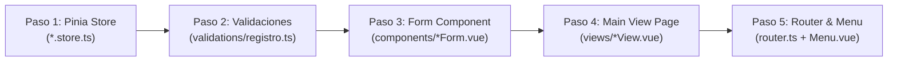

# Guía del Desarrollador Frontend — Sinergy

Esta guía es la referencia técnica definitiva para hacer crecer el frontend de Sinergy. Está ordenada estrictamente por el **orden de creación de código** (orden de dependencias): desde los contratos e infraestructura de API hasta las vistas y el enrutador. Si sigues cada sección en orden, serás capaz de construir cualquier módulo frontend nuevo sin errores de reactividad ni fallos de integración.

---

## Tabla de Contenidos

- [1. Mapa Arquitectónico del Frontend](#1-mapa-arquitectónico-del-frontend)
  - [1.1 Estructura de carpetas](#11-estructura-de-carpetas)
  - [1.2 Estructura interna de cada módulo](#12-estructura-interna-de-cada-módulo)
  - [1.3 Tecnologías y sus roles](#13-tecnologías-y-sus-roles)
- [2. El Orden de Creación de un Módulo Frontend](#2-el-orden-de-creación-de-un-módulo-frontend)
- [3. Paso 0 — Infraestructura HTTP y Contratos Core (`api.ts`, `RespuestaApi<T>`, Core Types)](#3-paso-0--infraestructura-http-y-contratos-core-apits-respuestaapit-core-types)
  - [3.1 La instancia Axios `api` de `@/core/api`](#31-la-instancia-axios-api-de-coreapi)
  - [3.2 Interceptores de request y auto-refresh de JWT](#32-interceptores-de-request-y-auto-refresh-de-jwt)
  - [3.3 El contrato global `RespuestaApi<T>`](#33-el-contrato-global-respuestaapit)
  - [3.4 Tipos transversales (`VuetifyForm`, `TabItem`)](#34-tipos-transversales-vuetifyform-tabitem)
- [4. Paso 1 — Gestión de Estado con Pinia (`*.store.ts`)](#4-paso-1--gestión-de-estado-con-pinia-storets)
  - [4.1 Sintaxis Composition API en stores](#41-sintaxis-composition-api-en-stores)
  - [4.2 Interfaces y DTOs del módulo](#42-interfaces-y-dtos-del-módulo)
  - [4.3 Estructura y acciones (GET, POST, PATCH, DELETE)](#43-estructura-y-acciones-get-post-patch-delete)
  - [4.4 Manejo tipado de errores con `AxiosError`](#44-manejo-tipado-de-errores-con-axioserror)
  - [4.5 Consumo correcto en vistas con `storeToRefs`](#45-consumo-correcto-en-vistas-con-storetorefs)
- [5. Paso 2 — Reglas de Validación Client-Side (`validations/registro.ts`)](#5-paso-2--reglas-de-validación-client-side-validationsregistrots)
  - [5.1 Estructura y sintaxis de reglas para Vuetify](#51-estructura-y-sintaxis-de-reglas-para-vuetify)
- [6. Paso 3 — Componente Formulario Reusable (`components/*Form.vue`)](#6-paso-3--componente-formulario-reusable-componentsformvue)
  - [6.1 Referencia tipada con `VuetifyForm`](#61-referencia-tipada-con-vuetifyform)
  - [6.2 Contrato de Props y Emits](#62-contrato-de-props-y-emits)
  - [6.3 Reactividad en edición con `watch` (`deep: true`)](#63-reactividad-en-edición-con-watch-deep-true)
  - [6.4 Reutilización del formulario (crear y editar)](#64-reutilización-del-formulario-crear-y-editar)
- [7. Paso 4 — La Vista Principal (`views/*View.vue`)](#7-paso-4--la-vista-principal-viewsviewvue)
  - [7.1 Estructura obligatoria de una vista](#71-estructura-obligatoria-de-una-vista)
  - [7.2 Carga inicial inmediata de datos](#72-carga-inicial-inmediata-de-datos)
  - [7.3 Vistas con pestañas con `AppTabs`](#73-vistas-con-pestañas-con-apptabs)
  - [7.4 Tabla de datos con `v-data-table`](#74-tabla-de-datos-con-v-data-table)
  - [7.5 Diálogo modal de confirmación (`v-dialog`)](#75-diálogo-modal-de-confirmación-v-dialog)
  - [7.6 Sistema de notificaciones (`useToast`)](#76-sistema-de-notificaciones-usetoast)
- [8. Paso 5 — Enrutamiento y Navegación (`router.ts` y `Menu.vue`)](#8-paso-5--enrutamiento-y-navegación-routerts-y-menuvue)
  - [8.1 Registro de rutas en Vue Router](#81-registro-de-rutas-en-vue-router)
  - [8.2 Navigation Guard de autenticación](#82-navigation-guard-de-autenticación)
  - [8.3 Integración en el menú lateral (`Menu.vue`)](#83-integración-en-el-menú-lateral-menuvue)
- [9. Tutorial Completo Paso a Paso: Crear el Módulo `proveedores`](#9-tutorial-completo-paso-a-paso-crear-el-módulo-proveedores)
- [10. Solución a Errores Comunes](#10-solución-a-errores-comunes)

---

## 1. Mapa Arquitectónico del Frontend

### 1.1 Estructura de carpetas

```
apps/frontend/
└── src/
    ├── components/              ← Componentes globales reutilizables en toda la app
    │   ├── AppTabs.vue          ← Wrapper de v-tabs con slots dinámicos
    │   ├── Menu.vue             ← Navegación lateral de la aplicación
    │   ├── SinergyChip.vue      ← Chip de estado reutilizable
    │   └── ThemeToggle.vue      ← Interruptor de tema claro/oscuro
    ├── core/                    ← Infraestructura transversal (no toca negocio)
    │   ├── api.ts               ← Instancia Axios con interceptores JWT
    │   ├── router.ts            ← Vue Router con Navigation Guard de auth
    │   ├── config/              ← Configuración de plugins (vuetify.ts, toast.ts)
    │   ├── constants/           ← Constantes globales del frontend
    │   └── types/
    │       ├── vuetifyForm.ts   ← Tipo para referenciar el formulario de Vuetify
    │       └── tabs.ts          ← Tipo para las pestañas de AppTabs
    ├── modules/                 ← Funcionalidades organizadas por dominio
    │   ├── auth/
    │   ├── dashboard/
    │   ├── plantas/             ← Módulo de referencia para esta guía
    │   ├── ubicaciones/
    │   ├── equipo/
    │   └── mantenimiento/
    └── views/
        └── NotFoundView.vue     ← Vista de ruta no encontrada (404)
```

### 1.2 Estructura interna de cada módulo

Cada módulo dentro de `src/modules/` sigue esta estructura autocontenida:

```
src/modules/plantas/
├── components/              ← Componentes UI exclusivos de este módulo
│   └── PlantaForm.vue       ← Formulario reusable (crear + editar)
├── validations/             ← Reglas de validación de Vuetify para los campos
│   └── registro.ts
├── views/                   ← Componentes de página (se montan en el router)
│   └── PlantasView.vue
└── plantas.store.ts         ← Estado global y llamadas API del módulo (Pinia)
```

### 1.3 Tecnologías y sus roles

| Tecnología | Rol en el proyecto |
|---|---|
| **Vue 3** + Composition API (`<script setup lang="ts">`) | Framework base de la SPA |
| **Pinia** | Estado global reactivo por módulo (`*.store.ts`) |
| **Vuetify 3** | Librería de componentes UI (tablas, formularios, diálogos, chips) |
| **Vue Router 4** | Navegación entre vistas con guard de autenticación |
| **Axios** (`src/core/api.ts`) | Cliente HTTP con interceptores automáticos de JWT y refresh |
| **vue-toastification** | Notificaciones de feedback al usuario |
| **TypeScript** | Tipado estricto en todos los archivos (sin `any`) |

---

## 2. El Orden de Creación de un Módulo Frontend

Para asegurar la coherencia del desarrollo y evitar imports circulares o componentes incompletos, un módulo frontend **debe crearse estrictamente en este orden de dependencias**:



> **¿Por qué este orden?**
> - Las **Validaciones** definen el contrato de comprobación de los campos del formulario.
> - El **Form Component** necesita las validaciones y los tipos DTO declarados en el **Store**.
> - La **Main View Page** incrusta el **Form Component** y consume las acciones/estado del **Store**.
> - El **Router** y el **Menú Lateral** registran y apuntan a la **Main View Page**.

---

## 3. Paso 0 — Infraestructura HTTP y Contratos Core (`api.ts`, `RespuestaApi<T>`, Core Types)

### 3.1 La instancia Axios `api` de `@/core/api`

Toda llamada al backend utiliza la instancia HTTP centralizada `api` en `apps/frontend/src/core/api.ts`:

```typescript
// En cualquier store o composable
import api from '../../core/api' // Instancia Axios centralizada con interceptores

// Petición GET pasando la interfaz de respuesta esperada como genérico
const { data } = await api.get<RespuestaApi<Planta[]>>('/plantas/listar')
```

### 3.2 Interceptores de request y auto-refresh de JWT

La instancia `api` gestiona de manera transparente:
1. **Interceptor de Request**: Adjunta automáticamente el token Bearer (`Authorization: Bearer <token>`) a cada petición si el usuario está autenticado.
2. **Interceptor de Response**: Si el servidor responde `401 Unauthorized`, intercepta el error, llama al endpoint `/auth/refresh` mediante HttpOnly Cookie, actualiza el token y reintenta la petición original sin interrumpir la sesión del usuario.

### 3.3 El contrato global `RespuestaApi<T>`

Todas las respuestas del backend son deserializadas bajo la interfaz `RespuestaApi<T>` (definida en `src/modules/auth/auth.store.ts` y reexportada para todo el proyecto):

```typescript
// apps/frontend/src/modules/auth/auth.store.ts

// Estructura universal de respuesta enviada por el backend en ResponseDTO
export interface RespuestaApi<T = void> {
  status: 'ok' | 'error' // Resultado de la operación
  message?: string       // Texto explicativo para notificaciones toast
  data?: T               // Payload fuertemente tipado en caso de éxito
}
```

### 3.4 Tipos transversales (`VuetifyForm`, `TabItem`)

- `VuetifyForm`: Interfaz en `src/core/types/vuetifyForm.ts` para tipar las referencias `<v-form ref="formRef">` (`validate()`, `reset()`, `resetValidation()`).
- `TabItem`: Interfaz en `src/core/types/tabs.ts` para tipar las pestañas consumidas por `AppTabs` (`id`, `name`, `color`).

---

## 4. Paso 1 — Gestión de Estado con Pinia (`*.store.ts`)

### 4.1 Sintaxis Composition API en stores

Todos los stores usan la sintaxis de **Composition API** (`defineStore('id', () => { ... })`).

### 4.2 Interfaces y DTOs del módulo

Las interfaces DTO se declaran al inicio del mismo archivo del store y se exportan para ser consumidas por las vistas y formularios:

```typescript
// DTO enviado al backend al registrar (POST /plantas/crear)
export interface RegistrarPlantaDTO {
    codigo: string
    nombre: string
    activa: boolean
}

// Entidad completa retornada por la API al consultar
export interface Planta {
    id: number
    codigo: string
    nombre: string
    activa: boolean
}
```

### 4.3 Estructura y acciones (GET, POST, PATCH, DELETE)

**Patrón completo del store (`plantas.store.ts`):**

```typescript
// apps/frontend/src/modules/plantas/plantas.store.ts
import { defineStore } from 'pinia'
import { ref } from 'vue'
import { type RespuestaApi } from '../auth/auth.store' // Contrato universal de API
import api from '../../core/api' // Instancia Axios con interceptores JWT
import { AxiosError } from 'axios' // Para tipar errores HTTP de red

export const usePlantasStore = defineStore('plantas', () => {

    // Estado reactivo (equivalente a data() en Options API)
    const plantas = ref<Planta[]>([])

    // Acción GET — Consulta el listado de plantas y actualiza la ref reactiva
    async function listarPlantas(): Promise<RespuestaApi<Planta[]>> {
        try {
            const { data } = await api.get<RespuestaApi<Planta[]>>('/plantas/listar')

            if (data.status === 'ok' && data.data) {
                plantas.value = data.data // Actualización reactiva del estado local
            }

            return data
        } catch (error: unknown) {
            const err = error as AxiosError<RespuestaApi>
            return {
                status: 'error',
                message: err.response?.data?.message ?? 'Error de red al listar las plantas'
            }
        }
    }

    // Acción POST — Envía nuevo registro y lo añade optimistamente al estado local
    async function registrarPlanta(planta: RegistrarPlantaDTO): Promise<RespuestaApi<Planta>> {
        try {
            const { data } = await api.post<RespuestaApi<Planta>>('/plantas/crear', planta)

            if (data.status === 'ok' && data.data) {
                plantas.value.push(data.data) // Agregar nuevo elemento al array sin re-consultar
            }

            return data
        } catch (error: unknown) {
            const err = error as AxiosError<RespuestaApi>
            return {
                status: 'error',
                message: err.response?.data?.message ?? 'Error de red al registrar la planta'
            }
        }
    }

    // Acción PATCH — Edición parcial y actualización reactiva en el array local
    async function editarPlanta(id: number, planta: Partial<RegistrarPlantaDTO>): Promise<RespuestaApi<Planta>> {
        try {
            const { data } = await api.patch<RespuestaApi<Planta>>(`/plantas/editar/${id}`, planta)

            if (data.status === 'ok' && data.data) {
                // Reemplazar solo el elemento actualizado en el estado reactivo
                const index = plantas.value.findIndex(p => p.id === id)
                if (index !== -1) {
                    plantas.value[index] = { ...plantas.value[index], ...data.data }
                }
            }

            return data
        } catch (error: unknown) {
            const err = error as AxiosError<RespuestaApi>
            return {
                status: 'error',
                message: err.response?.data?.message ?? 'Error de red al actualizar la planta'
            }
        }
    }

    // Acción DELETE — Borrado lógico (marca activa = false en el array local)
    async function eliminarPlanta(id: number): Promise<RespuestaApi<Planta>> {
        try {
            const { data } = await api.delete<RespuestaApi<Planta>>(`/plantas/eliminar/${id}`)

            if (data.status === 'ok') {
                const index = plantas.value.findIndex(p => p.id === id)
                if (index !== -1) {
                    plantas.value[index].activa = false // Marcar como inactiva localmente
                }
            }

            return data
        } catch (error: unknown) {
            const err = error as AxiosError<RespuestaApi>
            return {
                status: 'error',
                message: err.response?.data?.message ?? 'Error de red al eliminar la planta'
            }
        }
    }

    // Exponer estado reactivo y métodos consumibles por componentes/vistas
    return {
        plantas,
        listarPlantas,
        registrarPlanta,
        editarPlanta,
        eliminarPlanta
    }
})
```

### 4.4 Manejo tipado de errores con `AxiosError`

Las acciones nunca lanzan excepciones sin capturar. Todo `catch` transforma el error en un objeto `RespuestaApi` con `status: 'error'` y extrae el mensaje real enviado por el backend (`err.response?.data?.message`).

### 4.5 Consumo correcto en vistas con `storeToRefs`

Para mantener la reactividad al desestructurar el **estado**, usa siempre `storeToRefs`:

```typescript
import { storeToRefs } from 'pinia'
import { usePlantasStore } from '../plantas.store'

const plantaStore = usePlantasStore()

// Usar storeToRefs únicamente para las propiedades del estado (plantas)
const { plantas } = storeToRefs(plantaStore) 

// Los métodos/acciones se invocan directamente desde la instancia del store
const resultado = await plantaStore.registrarPlanta(datos)
```

---

## 5. Paso 2 — Reglas de Validación Client-Side (`validations/registro.ts`)

### 5.1 Estructura y sintaxis de reglas para Vuetify

Crea `src/modules/<modulo>/validations/registro.ts`. Exporta un objeto con arrays de funciones validadoras:

```typescript
// apps/frontend/src/modules/plantas/validations/registro.ts

// Reglas de validación para componentes Vuetify (:rules="registroRules.campo")
export const registroRules = {
    codigo: [
        // Cada función recibe el valor actual del input y retorna true si es válido o string si falla
        (value: string): boolean | string => {
            if (!value) return 'El código de la planta es obligatorio'
            return true
        }
    ],
    nombre: [
        (value: string): boolean | string => {
            if (!value) return 'El nombre de la planta es obligatorio'
            return true
        }
    ]
}
```

---

## 6. Paso 3 — Componente Formulario Reusable (`components/*Form.vue`)

### 6.1 Referencia tipada con `VuetifyForm`

Usa el tipo `VuetifyForm` importado del core para manejar la referencia del formulario:

```typescript
import type { VuetifyForm } from '../../../core/types/vuetifyForm'

// Referencia tipada para acceder a formRef.value.validate()
const formRef = ref<VuetifyForm | null>(null)
```

### 6.2 Contrato de Props y Emits

El formulario es agnóstico del modo (creación o edición). Recibe `datosIniciales`, `cargando`, `textoBoton` por props y notifica al componente padre mediante emits (`@submit`, `@cancelar`).

### 6.3 Reactividad en edición con `watch` (`deep: true`)

Para reflejar cambios en `datosIniciales` cuando se selecciona un registro existente para editar, incluye un `watch` profundo:

```typescript
// Actualizar la copia local si el padre modifica la prop datosIniciales
watch(() => props.datosIniciales, (nuevosDatos) => {
    formulario.value = { ...nuevosDatos }
}, { deep: true }) // Obligatorio deep: true para objetos anidados
```

### 6.4 Reutilización del formulario (crear y editar)

```vue
<!-- apps/frontend/src/modules/plantas/components/PlantaForm.vue -->
<script setup lang="ts">
import { ref, watch } from 'vue'
import { registroRules } from '../validations/registro.ts' // Reglas para :rules
import type { VuetifyForm } from '../../../core/types/vuetifyForm' // Tipo para ref de v-form
import type { RegistrarPlantaDTO } from '../plantas.store' // DTO de datos del módulo

// Props del componente padre
const props = defineProps<{
    datosIniciales: Partial<RegistrarPlantaDTO> // Datos precargados en edición
    cargando: boolean                             // Deshabilita inputs durante peticiones
    textoBoton: string                            // Texto dinámico del botón submit
}>()

// Eventos emitidos hacia la vista padre
const emit = defineEmits<{
    (e: 'submit', datos: RegistrarPlantaDTO): void // Notifica datos válidos listos para guardar
    (e: 'cancelar'): void                            // Notifica la cancelación del usuario
}>()

const formRef = ref<VuetifyForm | null>(null)
// Copia local reactiva para no mutar directamente la prop del padre
const formulario = ref<Partial<RegistrarPlantaDTO>>({ ...props.datosIniciales })

// Sincronizar datos si cambia el registro seleccionado desde la lista
watch(() => props.datosIniciales, (nuevosDatos) => {
    formulario.value = { ...nuevosDatos }
}, { deep: true })

// Manejar el submit validando contra las reglas de Vuetify
const manejarEnvio = async () => {
    if (!formRef.value) return
    const { valid } = await formRef.value.validate()

    if (valid) {
        emit('submit', formulario.value as RegistrarPlantaDTO)
    }
}
</script>

<template>
    <v-form ref="formRef" @submit.prevent="manejarEnvio">
        <v-row>
            <v-col cols="12" md="6">
                <!-- Campo Código con validaciones asignadas -->
                <v-text-field
                    v-model="formulario.codigo"
                    :rules="registroRules.codigo"
                    label="Código de la Planta"
                    variant="outlined"
                    required
                    :disabled="cargando"
                ></v-text-field>
            </v-col>
            <v-col cols="12" md="6">
                <!-- Campo Nombre con validaciones asignadas -->
                <v-text-field
                    v-model="formulario.nombre"
                    :rules="registroRules.nombre"
                    label="Nombre de la Planta"
                    variant="outlined"
                    required
                    :disabled="cargando"
                ></v-text-field>
            </v-col>
            <v-col cols="12" md="6">
                <!-- Switch Estado Activa -->
                <v-switch
                    v-model="formulario.activa"
                    color="success"
                    label="Estado de la Planta (Activa)"
                    hide-details
                    :disabled="cargando"
                ></v-switch>
            </v-col>
        </v-row>
        <v-card-actions class="px-0 mt-6">
            <v-spacer></v-spacer>
            <v-btn color="grey" variant="text" class="mr-2" @click="emit('cancelar')" :disabled="cargando">
                Cancelar
            </v-btn>
            <v-btn type="submit" color="primary" variant="flat" :loading="cargando" :disabled="cargando">
                {{ textoBoton }}
            </v-btn>
        </v-card-actions>
    </v-form>
</template>
```

---

## 7. Paso 4 — La Vista Principal (`views/*View.vue`)

### 7.1 Estructura obligatoria de una vista

La vista ensambla la lista, el formulario reusable, las pestañas, la tabla de datos, el diálogo modal y las notificaciones toast.

### 7.2 Carga inicial inmediata de datos

La petición de datos iniciales se invoca **directamente en el setup** de la vista, sin esperar a `onMounted`, optimizando el tiempo de primera carga.

### 7.3 Vistas con pestañas con `AppTabs`

Utiliza `AppTabs` pasando una lista de `TabItem[]` y vinculando la pestaña activa (`v-model="pestañaActiva"`).

### 7.4 Tabla de datos con `v-data-table`

Configura la tabla mediante `:headers` y `:items`, personalizando celdas como acciones o estados mediante los slots `#item.<columna>`.

### 7.5 Diálogo modal de confirmación (`v-dialog`)

Para operaciones destructivas o desactivaciones (soft delete), implementa un diálogo de confirmación controlado por un booleano reactivo.

### 7.6 Sistema de notificaciones (`useToast`)

Utiliza `useToast()` de `vue-toastification` para informar el resultado de cada acción (`toast.success()`, `toast.error()`).

---

## 8. Paso 5 — Enrutamiento y Navegación (`router.ts` y `Menu.vue`)

### 8.1 Registro de rutas en Vue Router

Registra la vista en `apps/frontend/src/core/router.ts` con carga perezosa (lazy loading):

```typescript
// En array routes de apps/frontend/src/core/router.ts
{
    path: '/plantas',
    name: 'plantas',
    component: () => import('../modules/plantas/views/PlantasView.vue'), // Import dinámico
    meta: { requiresAuth: true, hideLayout: false }, // Protegida por autenticación
}
```

### 8.2 Navigation Guard de autenticación

El Navigation Guard intercepta la navegación. Si la ruta posee `requiresAuth: true` y no hay sesión en memoria, intenta el refresco silencioso mediante la cookie `refreshToken`.

### 8.3 Integración en el menú lateral (`Menu.vue`)

Añade el elemento de menú en `src/components/Menu.vue` vinculándolo a la ruta configurada.

---

## 9. Tutorial Completo Paso a Paso: Crear el Módulo `proveedores`

A continuación se muestra el proceso completo para integrar el módulo `proveedores` en el frontend siguiendo el orden 1 $\rightarrow$ 5 con comentarios inline en cada código:

### Paso 1: Store (`proveedores.store.ts`)
```typescript
// Store Pinia en apps/frontend/src/modules/proveedores/proveedores.store.ts
import { defineStore } from 'pinia'
import { ref } from 'vue'
import { type RespuestaApi } from '../auth/auth.store' // Contrato de API
import api from '../../core/api' // Axios centralizado
import { AxiosError } from 'axios'

export interface RegistrarProveedorDTO {
    codigo: string
    nombre: string
    contacto?: string
    activo: boolean
}

export interface Proveedor {
    id: number
    codigo: string
    nombre: string
    contacto: string | null
    activo: boolean
}

export const useProveedoresStore = defineStore('proveedores', () => {
    // Estado reactivo
    const proveedores = ref<Proveedor[]>([])

    // Acción para obtener proveedores
    async function listarProveedores(): Promise<RespuestaApi<Proveedor[]>> {
        try {
            const { data } = await api.get<RespuestaApi<Proveedor[]>>('/proveedores/listar')
            if (data.status === 'ok' && data.data) proveedores.value = data.data
            return data
        } catch (error: unknown) {
            const err = error as AxiosError<RespuestaApi>
            return { status: 'error', message: err.response?.data?.message ?? 'Error al listar' }
        }
    }

    // Acción para crear proveedor
    async function registrarProveedor(datos: RegistrarProveedorDTO): Promise<RespuestaApi<Proveedor>> {
        try {
            const { data } = await api.post<RespuestaApi<Proveedor>>('/proveedores/crear', datos)
            if (data.status === 'ok' && data.data) proveedores.value.push(data.data)
            return data
        } catch (error: unknown) {
            const err = error as AxiosError<RespuestaApi>
            return { status: 'error', message: err.response?.data?.message ?? 'Error al registrar' }
        }
    }

    // Acción para editar proveedor
    async function editarProveedor(id: number, datos: Partial<RegistrarProveedorDTO>): Promise<RespuestaApi<Proveedor>> {
        try {
            const { data } = await api.patch<RespuestaApi<Proveedor>>(`/proveedores/editar/${id}`, datos)
            if (data.status === 'ok' && data.data) {
                const idx = proveedores.value.findIndex(p => p.id === id)
                if (idx !== -1) proveedores.value[idx] = { ...proveedores.value[idx], ...data.data }
            }
            return data
        } catch (error: unknown) {
            const err = error as AxiosError<RespuestaApi>
            return { status: 'error', message: err.response?.data?.message ?? 'Error al editar' }
        }
    }

    // Acción para eliminar/desactivar proveedor
    async function eliminarProveedor(id: number): Promise<RespuestaApi<Proveedor>> {
        try {
            const { data } = await api.delete<RespuestaApi<Proveedor>>(`/proveedores/eliminar/${id}`)
            if (data.status === 'ok') {
                const idx = proveedores.value.findIndex(p => p.id === id)
                if (idx !== -1) proveedores.value[idx].activo = false
            }
            return data
        } catch (error: unknown) {
            const err = error as AxiosError<RespuestaApi>
            return { status: 'error', message: err.response?.data?.message ?? 'Error al eliminar' }
        }
    }

    return { proveedores, listarProveedores, registrarProveedor, editarProveedor, eliminarProveedor }
})
```

### Paso 2: Validaciones (`validations/registro.ts`)
```typescript
// Validaciones en apps/frontend/src/modules/proveedores/validations/registro.ts
export const registroRules = {
    codigo: [
        (value: string): boolean | string => {
            if (!value) return 'El código del proveedor es obligatorio'
            return true
        }
    ],
    nombre: [
        (value: string): boolean | string => {
            if (!value) return 'El nombre del proveedor es obligatorio'
            return true
        }
    ]
}
```

### Paso 3: Componente Formulario (`components/ProveedorForm.vue`)
```vue
<!-- Formulario reusable en apps/frontend/src/modules/proveedores/components/ProveedorForm.vue -->
<script setup lang="ts">
import { ref, watch } from 'vue'
import { registroRules } from '../validations/registro'
import type { VuetifyForm } from '../../../core/types/vuetifyForm'
import type { RegistrarProveedorDTO } from '../proveedores.store'

const props = defineProps<{
    datosIniciales: Partial<RegistrarProveedorDTO>
    cargando: boolean
    textoBoton: string
}>()

const emit = defineEmits<{
    (e: 'submit', datos: RegistrarProveedorDTO): void
    (e: 'cancelar'): void
}>()

const formRef = ref<VuetifyForm | null>(null)
const formulario = ref<Partial<RegistrarProveedorDTO>>({ ...props.datosIniciales })

// Sincronizar datos al cambiar la prop
watch(() => props.datosIniciales, (nuevosDatos) => {
    formulario.value = { ...nuevosDatos }
}, { deep: true })

const manejarEnvio = async () => {
    if (!formRef.value) return
    const { valid } = await formRef.value.validate()
    if (valid) emit('submit', formulario.value as RegistrarProveedorDTO)
}
</script>

<template>
    <v-form ref="formRef" @submit.prevent="manejarEnvio">
        <v-row>
            <v-col cols="12" md="4">
                <v-text-field v-model="formulario.codigo" :rules="registroRules.codigo" label="Código" variant="outlined" :disabled="cargando"></v-text-field>
            </v-col>
            <v-col cols="12" md="8">
                <v-text-field v-model="formulario.nombre" :rules="registroRules.nombre" label="Nombre" variant="outlined" :disabled="cargando"></v-text-field>
            </v-col>
        </v-row>
        <v-card-actions class="px-0 mt-4">
            <v-spacer></v-spacer>
            <v-btn color="grey" variant="text" @click="emit('cancelar')" :disabled="cargando">Cancelar</v-btn>
            <v-btn type="submit" color="primary" variant="flat" :loading="cargando" :disabled="cargando">{{ textoBoton }}</v-btn>
        </v-card-actions>
    </v-form>
</template>
```

### Paso 4: Vista Principal (`views/ProveedoresView.vue`)
```vue
<!-- Vista principal en apps/frontend/src/modules/proveedores/views/ProveedoresView.vue -->
<script setup lang="ts">
import { ref } from 'vue'
import { storeToRefs } from 'pinia'
import { useToast } from 'vue-toastification'
import AppTabs from '../../../components/AppTabs.vue'
import ProveedorForm from '../components/ProveedorForm.vue'
import { useProveedoresStore, type RegistrarProveedorDTO, type Proveedor } from '../proveedores.store'
import type { TabItem } from '../../../core/types/tabs'

const toast = useToast()
const proveedorStore = useProveedoresStore()
const { proveedores } = storeToRefs(proveedorStore) // Referencia reactiva al array de proveedores

const cargando = ref<boolean>(false)
const pestañaActiva = ref<string | number>('lista')
const idEditar = ref<number | null>(null)

// Configuración de pestañas para AppTabs
const pestañas: TabItem[] = [
    { id: 'lista', name: 'Lista de Proveedores' },
    { id: 'registrar', name: 'Añadir Proveedor' },
    { id: 'editar', name: 'Editar Proveedor' }
]

const proveedorVacio: Partial<RegistrarProveedorDTO> = { codigo: '', nombre: '', activo: true }
const datosForm = ref<Partial<RegistrarProveedorDTO>>({ ...proveedorVacio })

// Petición inicial directa en el setup
const cargar = async () => {
    const res = await proveedorStore.listarProveedores()
    if (res.status === 'error') toast.error(res.message ?? 'Error al listar')
}
cargar()

// Preparar datos para edición y cambiar a la pestaña editar
const prepararEdicion = (item: Proveedor) => {
    idEditar.value = item.id
    datosForm.value = { codigo: item.codigo, nombre: item.nombre, activo: item.activo }
    pestañaActiva.value = 'editar'
}

// Guardado unificado para crear o editar
const manejarGuardado = async (datos: RegistrarProveedorDTO) => {
    cargando.value = true
    try {
        let res = pestañaActiva.value === 'registrar'
            ? await proveedorStore.registrarProveedor(datos)
            : await proveedorStore.editarProveedor(idEditar.value!, datos)

        if (res.status === 'ok') {
            toast.success(res.message ?? 'Operación exitosa')
            pestañaActiva.value = 'lista'
            datosForm.value = { ...proveedorVacio }
        } else {
            toast.error(res.message ?? 'Error')
        }
    } finally {
        cargando.value = false
    }
}
</script>

<template>
    <v-container fluid>
        <AppTabs v-model="pestañaActiva" :tabs="pestañas">
            <template #tab-lista>
                <v-data-table :items="proveedores" :headers="[{ title: 'Código', key: 'codigo' }, { title: 'Nombre', key: 'nombre' }, { title: 'Acciones', key: 'acciones' }]">
                    <template #item.acciones="{ item }">
                        <v-btn size="small" variant="text" color="primary" @click="prepararEdicion(item)">Editar</v-btn>
                    </template>
                </v-data-table>
            </template>

            <template #tab-registrar>
                <ProveedorForm :datos-iniciales="proveedorVacio" :cargando="cargando" texto-boton="Guardar" @submit="manejarGuardado" @cancelar="pestañaActiva = 'lista'" />
            </template>

            <template #tab-editar>
                <ProveedorForm :datos-iniciales="datosForm" :cargando="cargando" texto-boton="Actualizar" @submit="manejarGuardado" @cancelar="pestañaActiva = 'lista'" />
            </template>
        </AppTabs>
    </v-container>
</template>
```

### Paso 5: Ruta y Menú (`router.ts` y `Menu.vue`)
Registrar la ruta `/proveedores` en `router.ts` y añadir el enlace correspondiente en `Menu.vue`.

---

## 10. Solución a Errores Comunes

- **Pérdida de reactividad al desestructurar el Store**: Usar siempre `const { estado } = storeToRefs(store)` de `pinia`.
- **`formRef.value` es `null` al llamar `validate()`**: Asegurarse de que el elemento `<v-form ref="formRef">` esté montado en el DOM.
- **Formulario de edición no actualiza campos**: Añadir `{ deep: true }` al `watch` sobre `props.datosIniciales`.
- **Petición HTTP sin cabecera Authorization**: Usar la instancia centralizada `api` importada de `@/core/api`.
