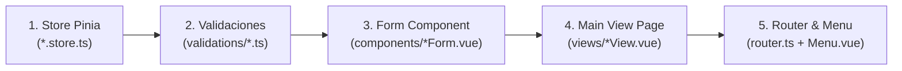

# Guía del Desarrollador Frontend — Sinergy (Manual Definitivo 10/10)

Esta guía es la referencia técnica definitiva y estandarizada para construir y extender el frontend de **Sinergy**. Diseñada bajo un enfoque agnóstico y universal, detalla **paso a paso** el proceso completo para levantar un nuevo módulo desde cero, integrando arquitectura en capas, reactividad limpia, pestañas dinámicas y mejores prácticas de experiencia de usuario (UX).

---

## Tabla de Contenidos

- [1. Infraestructura y Variables de Entorno](#1-infraestructura-y-variables-de-entorno)
  - [1.1 Configuración de `.env` (`VITE_API_URL`)](#11-configuración-de-env-vite_api_url)
  - [1.2 Instancia HTTP Axios Centralizada (`src/core/api.ts`)](#12-instancia-http-axios-centralizada-srccoreapits)
  - [1.3 Contratos Globales y Tipos Core](#13-contratos-globales-y-tipos-core)
- [2. Estructura Estándar de un Módulo Frontend](#2-estructura-estándar-de-un-módulo-frontend)
- [3. El Ciclo de Desarrollo de 5 Pasos](#3-el-ciclo-de-desarrollo-de-5-pasos)
  - [3.1 Paso 1 — Estado Global y DTOs con Pinia (`*.store.ts`)](#31-paso-1--estado-global-y-dtos-con-pinia-storets)
  - [3.2 Paso 2 — Reglas de Validación Client-Side (`validations/*.ts`)](#32-paso-2--reglas-de-validación-client-side-validationsts)
  - [3.3 Paso 3 — Componente Formulario Reutilizable (`components/*Form.vue`)](#33-paso-3--componente-formulario-reutilizable-componentsformvue)
  - [3.4 Paso 4 — La Vista Principal Dinámica (`views/*View.vue`)](#34-paso-4--la-vista-principal-dinámica-viewsviewvue)
  - [3.5 Paso 5 — Enrutamiento y Navegación (`router.ts` y `Menu.vue`)](#35-paso-5--enrutamiento-y-navegación-routerts-y-menuvue)
- [4. Patrones Clave de Interfaz y Usabilidad](#4-patrones-clave-de-interfaz-y-usabilidad)
  - [4.1 Pestañas Dinámicas con `AppTabs` y `computed`](#41-pestañas-dinámicas-con-apptabs-y-computed)
  - [4.2 Tablas de Datos (`v-data-table`), Alineación y `nowrap`](#42-tablas-de-datos-v-data-table-alineación-y-nowrap)
  - [4.3 Formateo de Fechas y Estados Operativos](#43-formateo-de-fechas-y-estados-operativos)
- [5. Tutorial Paso a Paso: Creación del Módulo Universal `proveedores`](#5-tutorial-paso-a-paso-creación-del-módulo-universal-proveedores)
- [6. Errores Comunes y Soluciones](#6-errores-comunes-y-soluciones)

---

## 1. Infraestructura y Variables de Entorno

### 1.1 Configuración de `.env` (`VITE_API_URL`)

El frontend se comunica con el servidor backend mediante endpoints REST configurados en los archivos de entorno de Vite:

```env
# apps/frontend/.env
VITE_API_URL=http://localhost:3000/api
```

> **Importante:** Todas las variables expuestas al cliente en Vite deben comenzar obligatoriamente con el prefijo `VITE_`. Se accede a ellas en código mediante `import.meta.env.VITE_API_URL`.

### 1.2 Instancia HTTP Axios Centralizada (`src/core/api.ts`)

Toda llamada HTTP al backend debe utilizar la instancia centralizada `api`:

```typescript
// apps/frontend/src/core/api.ts
import axios from 'axios'

const api = axios.create({
  baseURL: import.meta.env.VITE_API_URL || 'http://localhost:3000/api',
  withCredentials: true // Permite el envío/recepción de la cookie HttpOnly de refreshToken
})
```

**Características de la instancia `api`:**
1. **Bearer Token Automático:** Un interceptor de solicitud adjunta `Authorization: Bearer <accessToken>` si el token reside en la memoria de la app.
2. **Renovación Silenciosa (Auto-Refresh):** Si la API responde con `401 Unauthorized`, un interceptor de respuesta llama a `/auth/refresh`, actualiza el token en memoria y reintenta la petición original sin interrumpir al usuario.

### 1.3 Contratos Globales y Tipos Core

* **`RespuestaApi<T>`** (`src/modules/auth/auth.store.ts`): Contrato universal de respuesta emitido por el backend:
  ```typescript
  export interface RespuestaApi<T = void> {
    status: 'ok' | 'error'
    message?: string
    data?: T
  }
  ```
* **`VuetifyForm`** (`src/core/types/vuetifyForm.ts`): Interfaz para tipar las referencias de formularios de Vuetify (`ref<VuetifyForm | null>(null)`), habilitando autocomplete para `.validate()`, `.reset()` y `.resetValidation()`.
* **`TabItem`** (`src/core/types/tabs.ts`): Interfaz para configurar las pestañas en `AppTabs` (`{ id: string; name: string; color?: string }`).

---

## 2. Estructura Estándar de un Módulo Frontend

Cada módulo vive de manera autocontenida en `apps/frontend/src/modules/<nombre_modulo>/`:

```
src/modules/<modulo>/
├── components/                 ← Componentes UI exclusivos (ej. Formulario, Buscador)
│   └── <Modulo>Form.vue
├── validations/                ← Reglas de validación client-side para Vuetify
│   └── <modulo>.ts
├── views/                      ← Vista de página completa enrutada
│   └── <Modulo>View.vue
└── <modulo>.store.ts           ← Estado reactivo Pinia y llamadas HTTP
```

---

## 3. El Ciclo de Desarrollo de 5 Pasos

Para garantizar integridad y evitar referencias nulas, todo módulo se construye en el siguiente orden estricto de dependencias:



---

### 3.1 Paso 1 — Estado Global y DTOs con Pinia (`*.store.ts`)

Define los tipos de datos y la tienda Pinia utilizando la sintaxis de **Composition API** (`defineStore('id', () => { ... })`).

```typescript
// apps/frontend/src/modules/ejemplo/ejemplo.store.ts
import { defineStore } from 'pinia'
import { ref } from 'vue'
import api from '../../core/api'
import { type RespuestaApi } from '../auth/auth.store'
import { AxiosError } from 'axios'

export interface RegistrarEjemploDTO {
  codigo: string
  nombre: string
  activo: boolean
}

export interface Ejemplo {
  id: number
  codigo: string
  nombre: string
  activo: boolean
  creadoEn: string | Date
  actualizadoEn: string | Date
}

export const useEjemploStore = defineStore('ejemplo', () => {
  const elementos = ref<Ejemplo[]>([])

  async function listarElementos(): Promise<RespuestaApi<Ejemplo[]>> {
    try {
      const { data } = await api.get<RespuestaApi<Ejemplo[]>>('/ejemplo/listar')
      if (data.status === 'ok' && data.data) elementos.value = data.data
      return data
    } catch (error: unknown) {
      const err = error as AxiosError<RespuestaApi>
      return { status: 'error', message: err.response?.data?.message ?? 'Error al consultar' }
    }
  }

  async function crearElemento(datos: RegistrarEjemploDTO): Promise<RespuestaApi<Ejemplo>> {
    try {
      const { data } = await api.post<RespuestaApi<Ejemplo>>('/ejemplo/crear', datos)
      if (data.status === 'ok' && data.data) elementos.value.push(data.data)
      return data
    } catch (error: unknown) {
      const err = error as AxiosError<RespuestaApi>
      return { status: 'error', message: err.response?.data?.message ?? 'Error al registrar' }
    }
  }

  async function editarElemento(id: number, datos: Partial<RegistrarEjemploDTO>): Promise<RespuestaApi<Ejemplo>> {
    try {
      const { data } = await api.patch<RespuestaApi<Ejemplo>>(`/ejemplo/editar/${id}`, datos)
      if (data.status === 'ok' && data.data) {
        const index = elementos.value.findIndex(e => e.id === id)
        if (index !== -1) elementos.value[index] = { ...elementos.value[index], ...data.data }
      }
      return data
    } catch (error: unknown) {
      const err = error as AxiosError<RespuestaApi>
      return { status: 'error', message: err.response?.data?.message ?? 'Error al editar' }
    }
  }

  async function eliminarElemento(id: number): Promise<RespuestaApi<Ejemplo>> {
    try {
      const { data } = await api.delete<RespuestaApi<Ejemplo>>(`/ejemplo/eliminar/${id}`)
      if (data.status === 'ok') {
        const index = elementos.value.findIndex(e => e.id === id)
        if (index !== -1) elementos.value[index].activo = false
      }
      return data
    } catch (error: unknown) {
      const err = error as AxiosError<RespuestaApi>
      return { status: 'error', message: err.response?.data?.message ?? 'Error al eliminar' }
    }
  }

  return { elementos, listarElementos, crearElemento, editarElemento, eliminarElemento }
})
```

---

### 3.2 Paso 2 — Reglas de Validación Client-Side (`validations/*.ts`)

Exporta reglas de validación en funciones puras compatibles con la prop `:rules` de Vuetify:

```typescript
// apps/frontend/src/modules/ejemplo/validations/ejemplo.ts
export const ejemploRules = {
  codigo: [
    (val: string): boolean | string => (!!val && !!val.trim()) || 'El código es requerido'
  ],
  nombre: [
    (val: string): boolean | string => (!!val && !!val.trim()) || 'El nombre es requerido',
    (val: string): boolean | string => (val.trim().length <= 255) || 'Máximo 255 caracteres'
  ]
}
```

---

### 3.3 Paso 3 — Componente Formulario Reutilizable (`components/*Form.vue`)

Formulario desacoplado capaz de operar en modo creación o edición:

```vue
<!-- apps/frontend/src/modules/ejemplo/components/EjemploForm.vue -->
<script setup lang="ts">
import { ref, watch } from 'vue'
import { ejemploRules } from '../validations/ejemplo'
import type { VuetifyForm } from '../../../core/types/vuetifyForm'
import type { RegistrarEjemploDTO } from '../ejemplo.store'

const props = defineProps<{
  datosIniciales: Partial<RegistrarEjemploDTO>
  cargando: boolean
  textoBoton: string
}>()

const emit = defineEmits<{
  (e: 'submit', datos: RegistrarEjemploDTO): void
  (e: 'cancelar'): void
}>()

const formRef = ref<VuetifyForm | null>(null)
const formulario = ref<Partial<RegistrarEjemploDTO>>({ ...props.datosIniciales })

// Sincronizar copia local reactiva cuando cambie la prop desde el padre
watch(
  () => props.datosIniciales,
  (nuevosDatos) => { formulario.value = { ...nuevosDatos } },
  { deep: true }
)

const manejarEnvio = async (): Promise<void> => {
  if (!formRef.value) return
  const { valid } = await formRef.value.validate()
  if (valid) emit('submit', formulario.value as RegistrarEjemploDTO)
}
</script>

<template>
  <v-form ref="formRef" @submit.prevent="manejarEnvio">
    <v-row>
      <v-col cols="12" md="6">
        <v-text-field
          v-model="formulario.codigo"
          :rules="ejemploRules.codigo"
          label="Código"
          variant="outlined"
          :disabled="cargando"
        />
      </v-col>
      <v-col cols="12" md="6">
        <v-text-field
          v-model="formulario.nombre"
          :rules="ejemploRules.nombre"
          label="Nombre"
          variant="outlined"
          :disabled="cargando"
        />
      </v-col>
      <v-col cols="12">
        <v-switch
          v-model="formulario.activo"
          color="success"
          label="Estado Activo"
          hide-details
          :disabled="cargando"
        />
      </v-col>
    </v-row>
    <v-card-actions class="px-0 mt-4">
      <v-spacer />
      <v-btn color="grey" variant="text" @click="emit('cancelar')" :disabled="cargando">Cancelar</v-btn>
      <v-btn type="submit" color="primary" variant="flat" :loading="cargando" :disabled="cargando">{{ textoBoton }}</v-btn>
    </v-card-actions>
  </v-form>
</template>
```

---

### 3.4 Paso 4 — La Vista Principal Dinámica (`views/*View.vue`)

Ensambla las pestañas dinámicas, la tabla de datos formateada y centrada, el formulario de registro/edición y la confirmación de eliminación.

```vue
<!-- apps/frontend/src/modules/ejemplo/views/EjemploView.vue -->
<script setup lang="ts">
import { ref, computed, watch } from 'vue'
import { storeToRefs } from 'pinia'
import { useToast } from 'vue-toastification'
import AppTabs from '../../../components/AppTabs.vue'
import type { TabItem } from '../../../core/types/tabs'
import EjemploForm from '../components/EjemploForm.vue'
import { useEjemploStore, type RegistrarEjemploDTO, type Ejemplo } from '../ejemplo.store'

const toast = useToast()
const ejemploStore = useEjemploStore()
const { elementos } = storeToRefs(ejemploStore)

const cargando = ref(false)
const pestañaActiva = ref<string | number>('lista')
const idAEditar = ref<number | null>(null)

const elementoVacio: Partial<RegistrarEjemploDTO> = { codigo: '', nombre: '', activo: true }
const datosFormulario = ref<Partial<RegistrarEjemploDTO>>({ ...elementoVacio })

const mostrarDialogoEliminar = ref(false)
const idAEliminar = ref<number | null>(null)
const cargandoEliminacion = ref(false)

// ─── Pestañas Dinámicas Computadas ───────────────────────────────────────────
const pestañas = computed<TabItem[]>(() => {
  const items: TabItem[] = [
    { id: 'lista', name: 'Lista de Registros' },
    { id: 'registrar', name: 'Añadir Registro' }
  ]
  if (idAEditar.value !== null) {
    items.push({ id: 'editar', name: 'Editar Registro' })
  }
  return items
})

// ─── Headers Centrados de Tabla ──────────────────────────────────────────────
const headersTabla = [
  { title: 'Código', key: 'codigo', align: 'center' as const },
  { title: 'Nombre', key: 'nombre', align: 'center' as const },
  { title: 'Estado', key: 'activo', align: 'center' as const },
  { title: 'Fecha Creación', key: 'creadoEn', align: 'center' as const },
  { title: 'Última Actualización', key: 'actualizadoEn', align: 'center' as const },
  { title: 'Acciones', key: 'acciones', sortable: false, align: 'center' as const }
]

const formatearFecha = (fecha: Date | string | null | undefined): string => {
  if (!fecha) return '—'
  return new Date(fecha).toLocaleString('es-ES', {
    year: 'numeric', month: '2-digit', day: '2-digit', hour: '2-digit', minute: '2-digit'
  })
}

// Carga inicial
const cargarDatos = async () => {
  const res = await ejemploStore.listarElementos()
  if (res.status === 'error') toast.error(res.message ?? 'Error al listar')
}
cargarDatos()

const prepararEdicion = (item: Ejemplo) => {
  idAEditar.value = item.id
  datosFormulario.value = { codigo: item.codigo, nombre: item.nombre, activo: item.activo }
  pestañaActiva.value = 'editar'
}

const cancelarEdicion = () => {
  pestañaActiva.value = 'lista'
  idAEditar.value = null
  datosFormulario.value = { ...elementoVacio }
}

const manejarGuardado = async (datos: RegistrarEjemploDTO) => {
  cargando.value = true
  try {
    const res = pestañaActiva.value === 'registrar'
      ? await ejemploStore.crearElemento(datos)
      : await ejemploStore.editarElemento(idAEditar.value!, datos)

    if (res.status === 'ok') {
      toast.success(res.message ?? 'Operación exitosa')
      cancelarEdicion()
    } else {
      toast.error(res.message ?? 'Error')
    }
  } finally {
    cargando.value = false
  }
}

const prepararEliminacion = (id: number) => {
  idAEliminar.value = id
  mostrarDialogoEliminar.value = true
}

const ejecutarEliminacion = async () => {
  if (!idAEliminar.value) return
  cargandoEliminacion.value = true
  try {
    const res = await ejemploStore.eliminarElemento(idAEliminar.value)
    if (res.status === 'ok') {
      toast.success(res.message ?? 'Registro desactivado')
      mostrarDialogoEliminar.value = false
    } else {
      toast.error(res.message ?? 'Error al eliminar')
    }
  } finally {
    cargandoEliminacion.value = false
  }
}

// Reset automático de selección al volver a lista o registrar
watch(pestañaActiva, (nueva) => {
  if (nueva === 'lista' || nueva === 'registrar') {
    idAEditar.value = null
    datosFormulario.value = { ...elementoVacio }
  }
})
</script>

<template>
  <v-container fluid class="ejemplo-dashboard">
    <AppTabs v-model="pestañaActiva" :tabs="pestañas">
      <template #tab-lista>
        <v-data-table :items="elementos" :headers="headersTabla">
          <template #item.activo="{ item }">
            <v-chip :color="item.activo ? 'success' : 'error'" size="small">
              {{ item.activo ? 'Activo' : 'Inactivo' }}
            </v-chip>
          </template>
          <template #item.creadoEn="{ item }"><span>{{ formatearFecha(item.creadoEn) }}</span></template>
          <template #item.actualizadoEn="{ item }"><span>{{ formatearFecha(item.actualizadoEn) }}</span></template>
          <template #item.acciones="{ item }">
            <div class="d-flex ga-2 align-center justify-center">
              <v-btn color="primary" variant="text" size="small" @click="prepararEdicion(item)" prepend-icon="mdi-file-edit">Editar</v-btn>
              <v-btn color="error" variant="text" size="small" @click="prepararEliminacion(item.id)" :disabled="!item.activo" prepend-icon="mdi-minus-circle">Eliminar</v-btn>
            </div>
          </template>
        </v-data-table>
      </template>

      <template #tab-registrar>
        <v-card class="pa-4" elevation="0">
          <v-card-title class="px-0 mb-4 text-h5 font-weight-bold">Registrar Nuevo</v-card-title>
          <EjemploForm :datos-iniciales="elementoVacio" :cargando="cargando" texto-boton="Guardar" @submit="manejarGuardado" @cancelar="cancelarEdicion" />
        </v-card>
      </template>

      <template #tab-editar>
        <v-card class="pa-4" elevation="0" v-if="idAEditar !== null">
          <v-card-title class="px-0 mb-4 text-h5 font-weight-bold">Editar Registro</v-card-title>
          <EjemploForm :datos-iniciales="datosFormulario" :cargando="cargando" texto-boton="Actualizar" @submit="manejarGuardado" @cancelar="cancelarEdicion" />
        </v-card>
      </template>
    </AppTabs>

    <v-dialog v-model="mostrarDialogoEliminar" max-width="500px" persistent>
      <v-card>
        <v-card-title class="text-h6 font-weight-bold text-error">Confirmar Acción</v-card-title>
        <v-card-text>¿Está seguro de que desea desactivar este elemento?</v-card-text>
        <v-card-actions>
          <v-spacer />
          <v-btn color="grey-darken-1" variant="text" @click="mostrarDialogoEliminar = false" :disabled="cargandoEliminacion">Cancelar</v-btn>
          <v-btn color="error" variant="flat" @click="ejecutarEliminacion" :loading="cargandoEliminacion">Eliminar</v-btn>
        </v-card-actions>
      </v-card>
    </v-dialog>
  </v-container>
</template>

<style scoped>
.ejemplo-dashboard :deep(.v-data-table th),
.ejemplo-dashboard :deep(.v-data-table td) {
  white-space: nowrap !important;
  text-align: center !important;
}
</style>
```

---

### 3.5 Paso 5 — Enrutamiento y Navegación (`router.ts` y `Menu.vue`)

1. **Registrar la ruta en `src/core/router.ts`:**
```typescript
{
  path: '/ejemplo',
  name: 'ejemplo',
  component: () => import('../modules/ejemplo/views/EjemploView.vue'),
  meta: { requiresAuth: true }
}
```

2. **Añadir el ítem de navegación en `src/components/Menu.vue`:**
```vue
<v-list-item
  prepend-icon="mdi-cube-outline"
  title="Gestión de Ejemplos"
  value="ejemplo"
  to="/ejemplo"
/>
```

---

## 4. Patrones Clave de Interfaz y Usabilidad

### 4.1 Pestañas Dinámicas con `AppTabs` y `computed`
* **Regla:** La pestaña de edición **NUNCA** debe mostrarse en la barra superior de `AppTabs` hasta que el usuario seleccione activamente un elemento de la tabla.
* **Implementación:** Se define `pestañas` como `computed<TabItem[]>`. Si `idAEditar !== null`, se inyecta la pestaña `'editar'`.
* **Desmontaje seguro:** El slot `#tab-editar` usa `v-if="idAEditar !== null"` para evitar instanciar componentes con datos nulos.

### 4.2 Tablas de Datos (`v-data-table`), Alineación y `nowrap`
* **Encabezados centrados:** En la definición de columnas (`headersTabla`), incluir `align: 'center' as const`.
* **Prevención de salto de línea:** Aplicar CSS scoped en la vista:
  ```css
  .mi-modulo :deep(.v-data-table th),
  .mi-modulo :deep(.v-data-table td) {
    white-space: nowrap !important;
    text-align: center !important;
  }
  ```

### 4.3 Formateo de Fechas y Estados Operativos
Utiliza funciones auxiliares en la vista para formatear fechas ISO a cadenas comprensibles locales (`.toLocaleString('es-ES', ...)`).

---

## 5. Tutorial Paso a Paso: Creación del Módulo Universal `proveedores`

Sigue estos 5 pasos ordenados para crear el módulo `proveedores`:

1. **`src/modules/proveedores/proveedores.store.ts`**: Crea las interfaces `Proveedor` y `RegistrarProveedorDTO`. Implementa `listarProveedores`, `crearProveedor`, `editarProveedor` y `eliminarProveedor`.
2. **`src/modules/proveedores/validations/proveedores.ts`**: Exporta `proveedorRules` con validadores de código y RIF/Nombre.
3. **`src/modules/proveedores/components/ProveedorForm.vue`**: Formulario Vuetify con `props.datosIniciales`, `watch({ deep: true })` y emisión `@submit`.
4. **`src/modules/proveedores/views/ProveedoresView.vue`**: Vista con `pestañas` computadas, headers centrados y estilos `nowrap`.
5. **`src/core/router.ts` & `src/components/Menu.vue`**: Añade la ruta `/proveedores` y el item en el menú lateral.

---

## 6. Errores Comunes y Soluciones

* **Pérdida de reactividad al desestructurar la Store:** Usa siempre `const { elementos } = storeToRefs(store)` para el estado. Invoca los métodos directamente (`store.listar()`).
* **Formulario de edición no refresca sus campos al cambiar de ítem:** Asegúrate de incluir `{ deep: true }` en el `watch` sobre `props.datosIniciales` dentro de `*Form.vue`.
* **Pestaña de edición abierta sin datos seleccionados:** Verifica que `idAEditar` se reinicie a `null` dentro del `watch(pestañaActiva)` al conmutar a `'lista'` o `'registrar'`.
* **Encabezados de tabla rotos en múltiples líneas:** Revisa que el CSS `:deep(.v-data-table th)` contenga `white-space: nowrap !important`.
* **Fuga de estado al navegar entre nodos jerárquicos:** Si seleccionas un componente en un árbol o lista y luego cambias a otro que no posee elementos (ej. variables críticas o puntos de lubricación), el estado en el store debe limpiarse inmediatamente (`items.value = []`) al invocar la acción y antes de la promesa HTTP. De lo contrario, la vista retendrá visualmente los datos del nodo anterior.
* **Pantalla en blanco / Scrim opaco al desplegar selects o menús en Dark Mode:** Ocurre cuando se agregan reglas CSS globales como `.v-sheet::before { display: none }` o z-index forzados. Vuetify 3 utiliza pseudo-elementos y el portal `v-overlay-container` para calcular la posición y opacidad de los menús. Nunca manipules los pseudo-elementos internos de Vuetify globalmente.

---

## 7. Sistema de Temas, Modo Oscuro y Coexistencia con Vuetify 3

### 7.1 Regla de Oro: Overlays, Portales y Scrims
Vuetify 3 renderiza los componentes flotantes (`v-menu`, `v-select`, `v-autocomplete`, `v-tooltip`, `v-dialog`) fuera del árbol DOM normal utilizando teleports hacia `<div class="v-overlay-container">`.
* **Prohibido:** Modificar `::before` o `::after` de manera genérica en `.v-sheet`, `.v-card` o `.v-overlay`.
* **Prohibido:** Forzar fondos o bordes con `!important` en todas las instancias de `v-card` o `v-sheet` en archivos CSS globales, ya que esto anula los estilos calculados dinámicamente para los menús flotantes.

### 7.2 Calibración Limpia de Bordes en Modo Oscuro
Para reducir la dureza visual de los campos sin romper la accesibilidad ni generar saltos de renderizado (`layout shift`), se utiliza la variable CSS nativa de Vuetify en `src/assets/theme.css`:

```css
/* Reducir intensidad del borde de campos en reposo sin eliminar la estructura */
.v-theme--sinergyDarkTheme .v-field--variant-outlined .v-field__outline {
  --v-field-border-opacity: 0.12;
}

/* Resaltar contorno de manera elegante únicamente al enfocar */
.v-theme--sinergyDarkTheme .v-field--focused.v-field--variant-outlined .v-field__outline {
  --v-field-border-opacity: 0.7;
}
```

### 7.3 Eliminación de Rayas Grises en Hojas Elevadas (`AppTabs`)
En modo oscuro, Vuetify aplica una capa blanca semitransparente según el nivel de elevación (`elevation="2"`). Cuando varias hojas se apilan (como en `AppTabs`), esta elevación genera una franja o "raya gris" visible.
* **Solución estándar:** Declarar `elevation="0"` explícitamente en el componente `v-sheet` contenedor y en el contenido de las pestañas (`v-tabs-window-item`).

### 7.4 Coexistencia Vuetify 3 + Bootstrap 5
`App.vue` sincroniza el tema global con el atributo `data-bs-theme`:
* `theme.global.name.value === 'sinergyDarkTheme'` establece `document.documentElement.setAttribute('data-bs-theme', 'dark')`.
* `src/assets/theme.css` sincroniza las variables `--bs-body-bg`, `--bs-surface`, `--bs-border-color` para que componentes mixtos (tablas, clases de utilidad) armonicen visualmente con el tema oscuro industrial.
