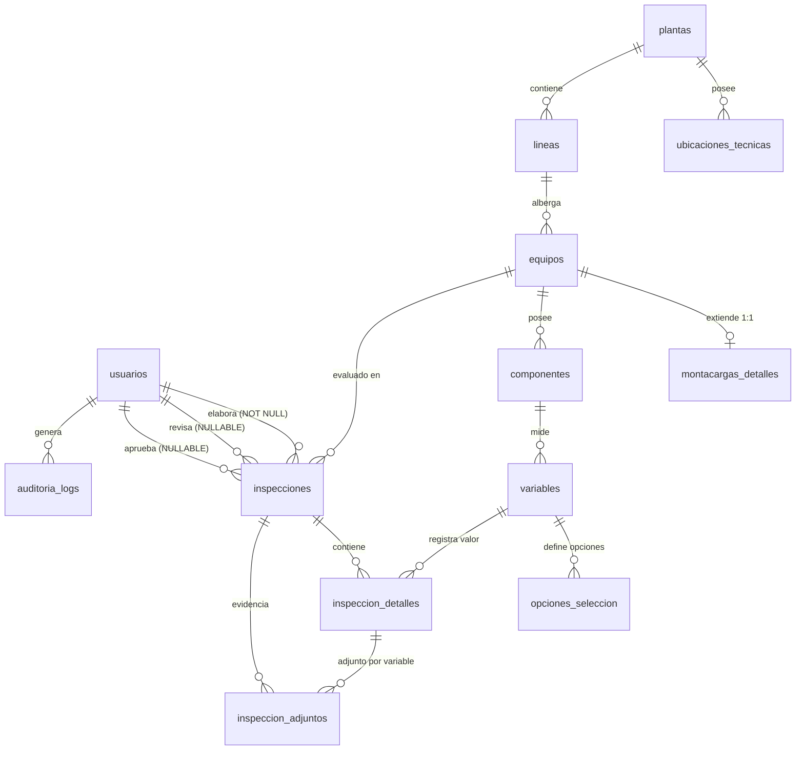

# Modelo Entidad-Relación (MER / ERM) — Sistema Sinergy

**Cliente / Empresa:** Tubrica
**Sistema:** Plataforma Digital de Mantenimiento e Inspección Industrial (Sinergy)
**Motor Target:** PostgreSQL 14+ / Prisma ORM
**Versión:** 3.0 (Enterprise / Alta Disponibilidad)
**Fecha de Última Revisión:** 21 de Julio de 2026

---

## 1. Enunciado General y Reglas de Negocio del Dominio

El modelo de datos de Sinergy está diseñado bajo el patrón **Data-Driven UI** y cumple con la norma relacional en 3ª Forma Normal (3FN), garantizando la separación estricta entre **Tablas Maestras** (configuración física y organizativa de la planta) y **Tablas Transaccionales** (registro operativo diario de inspecciones).

### A. Reglas de Jerarquía Física (Estructura de Planta)

1. **Plantas (`plantas`):** 3 plantas de Tubrica.
2. **Ubicaciones Técnicas (`ubicaciones_tecnicas`):** Nodos geográficos o lógicos pertenecientes a una Planta (`planta_id`). La FK `planta_id` es **nullable** por requerimiento de flexibilidad operativa.
3. **Líneas de Producción (`lineas`):** 6–17 líneas por planta. Clave compuesta única: `(codigo, planta_id)`.
4. **Equipos (`equipos`):** Activos físicos con tipos controlados por ENUM: `MAQUINARIA`, `MONTACARGAS`, `COMPRESOR`, `GENERADOR`, `CHILLER`. `linea_id` es nullable para equipos móviles (montacargas).
5. **Detalles de Montacargas (`montacargas_detalles`):** Extensión 1:1 de `equipos`. Almacena Denominación, Tipo, Marca, Modelo, Identificación Abreviada (`M09`), Ubicación Técnica y Denominación 2.
6. **Componentes (`componentes`):** Partes funcionales de un equipo. Ordenables por `orden_posicion`.
7. **Variables (`variables`):** Parámetros de medición por componente. Su `tipo_evaluacion` (ENUM) controla el control de UI renderizado:
   - `NUMERICO_ENTERO` → `<input type="number" step="1">`
   - `NUMERICO_DECIMAL` → `<input type="number" step="0.01">`
   - `TEMPERATURA` → `<input type="number">` + badge de unidad (`°C` / `°F`)
   - `SELECCION` → `<select>` cargado desde `opciones_seleccion`
8. **Opciones de Selección (`opciones_seleccion`):** Catálogo por variable tipo `SELECCION`. Claves: `N`, `E`, `A`, `B`, `NE`, `N/A`.

### B. Reglas Transaccionales (Trazabilidad e Inspecciones)

1. **Usuarios (`usuarios`):** RBAC con ENUM `Rol`: `ADMINISTRADOR`, `SUPERVISOR`, `TECNICO`. Las cuentas se **desactivan** (`activo = false`), nunca se borran.
2. **Inspecciones (`inspecciones`):** Cabecera de trazabilidad tripartita. `id` es **BIGINT** (alta escala). La columna `elaborado_por` es `NOT NULL` (JWT); `revisado_por` y `aprobado_por` son opcionales (firmas posteriores). Soporta captura `OFFLINE_SYNC`.
3. **Detalle de Inspección (`inspeccion_detalles`):** Registro por variable evaluada. `id` es **BIGINT**. Persiste `valor_numerico` o `valor_seleccion` de forma mutuamente excluyente.
4. **Adjuntos (`inspeccion_adjuntos`):** Evidencia fotográfica o documental. `detalle_id` es nullable (adjunto a toda la inspección o a una variable específica). `id` es **BIGINT**.
5. **Logs de Auditoría (`auditoria_logs`):** Registro inmutable con JSONB previo/posterior. `id` y `registro_id` son **BIGINT** para cubrir IDs de cualquier tabla.

---

## 2. Tipos Enumerados (ENUMs PostgreSQL)

| ENUM | Valores |
|---|---|
| `rol_enum` | `ADMINISTRADOR`, `SUPERVISOR`, `TECNICO` |
| `tipo_equipo_enum` | `MAQUINARIA`, `MONTACARGAS`, `COMPRESOR`, `GENERADOR`, `CHILLER` |
| `estado_operativo_enum` | `OPERATIVO`, `INOPERATIVO`, `EN_MANTENIMIENTO` |
| `tipo_evaluacion_enum` | `NUMERICO_ENTERO`, `NUMERICO_DECIMAL`, `TEMPERATURA`, `SELECCION` |
| `tipo_inspeccion_enum` | `VARIABLES_CRITICAS`, `MONTACARGAS`, `COMPRESOR`, `GENERADOR`, `CHILLER` |
| `estado_inspeccion_enum` | `BORRADOR`, `PENDIENTE`, `APROBADO`, `RECHAZADO` |
| `origen_datos_enum` | `ONLINE`, `OFFLINE_SYNC` |

---

## 3. Diagrama Entidad-Relación (Mermaid)

---

## 4. Catálogo de Tablas y Columnas

### Tabla: `usuarios`
| Columna | Tipo SQL | Restricción | Descripción |
|---|---|---|---|
| `id` | `SERIAL` | `PK` | Identificador autoincremental |
| `nombre` | `VARCHAR(100)` | `NOT NULL` | Primer nombre |
| `apellido` | `VARCHAR(100)` | `NOT NULL` | Apellido |
| `email` | `VARCHAR(150)` | `NOT NULL, UNIQUE` | Credencial de acceso |
| `password_hash` | `VARCHAR(255)` | `NOT NULL` | Hash bcrypt. Nunca texto plano. |
| `rol` | `rol_enum` | `NOT NULL, DEFAULT 'TECNICO'` | Rol RBAC |
| `activo` | `BOOLEAN` | `NOT NULL, DEFAULT TRUE` | FALSE = deshabilitado, nunca borrado |
| `ultimo_acceso` | `TIMESTAMPTZ` | `NULL` | Timestamp del último login exitoso |
| `creado_en` | `TIMESTAMPTZ` | `NOT NULL, DEFAULT NOW()` | Fecha de creación |
| `actualizado_en` | `TIMESTAMPTZ` | `NOT NULL, DEFAULT NOW()` | Actualizado por trigger |

---

### Tabla: `ubicaciones_tecnicas`
| Columna | Tipo SQL | Restricción | Descripción |
|---|---|---|---|
| `id` | `SERIAL` | `PK` | Identificador autoincremental |
| `codigo` | `VARCHAR(50)` | `NOT NULL, UNIQUE` | Ej: `1000-DES-MT01` |
| `nombre` | `VARCHAR(255)` | `NOT NULL` | Nombre descriptivo |
| `descripcion` | `TEXT` | `NULL` | Descripción larga |
| `planta_id` | `INTEGER` | `NULL, FK → plantas(id) SET NULL` | Nullable por flexibilidad del negocio |
| `creado_en` | `TIMESTAMPTZ` | `NOT NULL, DEFAULT NOW()` | — |
| `actualizado_en` | `TIMESTAMPTZ` | `NOT NULL, DEFAULT NOW()` | Actualizado por trigger |

---

### Tabla: `plantas`
| Columna | Tipo SQL | Restricción | Descripción |
|---|---|---|---|
| `id` | `SERIAL` | `PK` | — |
| `codigo` | `VARCHAR(50)` | `NOT NULL, UNIQUE` | Ej: `1000` |
| `nombre` | `VARCHAR(255)` | `NOT NULL, UNIQUE` | Nombre único de la planta |
| `activa` | `BOOLEAN` | `NOT NULL, DEFAULT TRUE` | — |
| `creado_en` | `TIMESTAMPTZ` | `NOT NULL, DEFAULT NOW()` | — |
| `actualizado_en` | `TIMESTAMPTZ` | `NOT NULL, DEFAULT NOW()` | Actualizado por trigger |

---

### Tabla: `lineas`
| Columna | Tipo SQL | Restricción | Descripción |
|---|---|---|---|
| `id` | `SERIAL` | `PK` | — |
| `codigo` | `VARCHAR(50)` | `NOT NULL` | Ej: `L13`. Único por planta. |
| `nombre` | `VARCHAR(255)` | `NOT NULL` | Ej: `Línea #13 Extrusión` |
| `planta_id` | `INTEGER` | `NOT NULL, FK → plantas(id) RESTRICT` | — |
| `activa` | `BOOLEAN` | `NOT NULL, DEFAULT TRUE` | — |
| `creado_en` | `TIMESTAMPTZ` | `NOT NULL, DEFAULT NOW()` | — |
| `actualizado_en` | `TIMESTAMPTZ` | `NOT NULL, DEFAULT NOW()` | Actualizado por trigger |
| — | — | `UNIQUE (codigo, planta_id)` | Clave compuesta |

---

### Tabla: `equipos`
| Columna | Tipo SQL | Restricción | Descripción |
|---|---|---|---|
| `id` | `SERIAL` | `PK` | — |
| `codigo` | `VARCHAR(100)` | `NOT NULL, UNIQUE` | Ej: `1000MTC00009` |
| `nombre` | `VARCHAR(255)` | `NOT NULL` | — |
| `tipo_equipo` | `tipo_equipo_enum` | `NOT NULL` | Controlado por ENUM |
| `linea_id` | `INTEGER` | `NULL, FK → lineas(id) SET NULL` | Nullable para montacargas y móviles |
| `serial` | `VARCHAR(100)` | `NULL` | — |
| `marca` | `VARCHAR(100)` | `NULL` | — |
| `modelo` | `VARCHAR(100)` | `NULL` | — |
| `estado_operativo` | `estado_operativo_enum` | `NOT NULL, DEFAULT 'OPERATIVO'` | — |
| `observacion` | `TEXT` | `NULL` | — |
| `creado_en` | `TIMESTAMPTZ` | `NOT NULL, DEFAULT NOW()` | — |
| `actualizado_en` | `TIMESTAMPTZ` | `NOT NULL, DEFAULT NOW()` | Actualizado por trigger |

---

### Tabla: `montacargas_detalles` (Extensión 1:1)
| Columna | Tipo SQL | Restricción | Descripción |
|---|---|---|---|
| `id` | `SERIAL` | `PK` | — |
| `equipo_id` | `INTEGER` | `NOT NULL, UNIQUE, FK → equipos(id) CASCADE` | Clave de la relación 1:1 |
| `denominacion` | `VARCHAR(255)` | `NOT NULL` | Ej: `Montacarga Yale GLP090 M09` |
| `tipo_montacarga` | `VARCHAR(100)` | `NOT NULL, DEFAULT 'Montacarga'` | — |
| `marca` | `VARCHAR(100)` | `NOT NULL` | Ej: `Yale` |
| `modelo` | `VARCHAR(100)` | `NOT NULL` | Ej: `GLP090` |
| `identificacion_abreviada` | `VARCHAR(50)` | `NOT NULL` | Ej: `M09` |
| `ubicacion_tecnica_texto` | `VARCHAR(100)` | `NOT NULL` | Ej: `1000-DES-MT01` |
| `denominacion_2` | `TEXT` | `NULL` | Descripción detallada de la ubicación técnica |

---

### Tabla: `componentes`
| Columna | Tipo SQL | Restricción | Descripción |
|---|---|---|---|
| `id` | `SERIAL` | `PK` | — |
| `equipo_id` | `INTEGER` | `NOT NULL, FK → equipos(id) CASCADE` | — |
| `nombre` | `VARCHAR(255)` | `NOT NULL` | Ej: `Motor Principal A` |
| `descripcion` | `TEXT` | `NULL` | — |
| `activo` | `BOOLEAN` | `NOT NULL, DEFAULT TRUE` | Filtrado en carga de formulario |
| `orden_posicion` | `INTEGER` | `NOT NULL, DEFAULT 0` | Orden de aparición en UI |
| `creado_en` | `TIMESTAMPTZ` | `NOT NULL, DEFAULT NOW()` | — |
| `actualizado_en` | `TIMESTAMPTZ` | `NOT NULL, DEFAULT NOW()` | Actualizado por trigger |

---

### Tabla: `variables`
| Columna | Tipo SQL | Restricción | Descripción |
|---|---|---|---|
| `id` | `SERIAL` | `PK` | — |
| `componente_id` | `INTEGER` | `NOT NULL, FK → componentes(id) CASCADE` | — |
| `nombre` | `VARCHAR(255)` | `NOT NULL` | Ej: `Temp (°C) Rod Lado Libre` |
| `tipo_evaluacion` | `tipo_evaluacion_enum` | `NOT NULL` | Controla el control de UI |
| `unidad` | `VARCHAR(20)` | `NULL` | Ej: `°C`, `PSI`, `RPM`, `A` |
| `valor_minimo` | `NUMERIC(12,4)` | `NULL` | Umbral inferior seguro |
| `valor_maximo` | `NUMERIC(12,4)` | `NULL` | Umbral superior seguro |
| `orden_posicion` | `INTEGER` | `NOT NULL, DEFAULT 0` | — |
| `activa` | `BOOLEAN` | `NOT NULL, DEFAULT TRUE` | — |
| `creado_en` | `TIMESTAMPTZ` | `NOT NULL, DEFAULT NOW()` | — |
| `actualizado_en` | `TIMESTAMPTZ` | `NOT NULL, DEFAULT NOW()` | Actualizado por trigger |

---

### Tabla: `opciones_seleccion`
| Columna | Tipo SQL | Restricción | Descripción |
|---|---|---|---|
| `id` | `SERIAL` | `PK` | — |
| `variable_id` | `INTEGER` | `NOT NULL, FK → variables(id) CASCADE` | — |
| `clave` | `VARCHAR(10)` | `NOT NULL` | `N`, `E`, `A`, `B`, `NE`, `N/A` |
| `etiqueta` | `VARCHAR(100)` | `NOT NULL` | `Normal`, `Existe`, `Anormal`, `Bajo`, `No Existe`, `No Aplica` |
| `orden_posicion` | `INTEGER` | `NOT NULL, DEFAULT 0` | — |
| — | — | `UNIQUE (variable_id, clave)` | Integridad del catálogo |

---

### Tabla: `inspecciones`

> [!WARNING]
> `id` es `BIGSERIAL` (64-bit). Un sistema industrial con inspecciones diarias puede superar los 2.1M de registros a largo plazo.

| Columna | Tipo SQL | Restricción | Descripción |
|---|---|---|---|
| `id` | `BIGSERIAL` | `PK` | Identificador de 64 bits |
| `codigo_inspeccion` | `VARCHAR(100)` | `NOT NULL, UNIQUE` | Ej: `INSP-20260721-0001` |
| `tipo_inspeccion` | `tipo_inspeccion_enum` | `NOT NULL` | — |
| `equipo_id` | `INTEGER` | `NOT NULL, FK → equipos(id) RESTRICT` | Equipo inspeccionado |
| `elaborado_por` | `INTEGER` | `NOT NULL, FK → usuarios(id) RESTRICT` | Tomado del JWT. Inalterable. |
| `revisado_por` | `INTEGER` | `NULL, FK → usuarios(id) SET NULL` | Firma posterior del supervisor |
| `aprobado_por` | `INTEGER` | `NULL, FK → usuarios(id) SET NULL` | Firma posterior de jefatura |
| `fecha_registro` | `TIMESTAMPTZ` | `NOT NULL, DEFAULT NOW()` | Timestamp de captura en planta |
| `fecha_sincronizacion` | `TIMESTAMPTZ` | `NULL` | Timestamp de llegada al servidor (offline) |
| `estado_inspeccion` | `estado_inspeccion_enum` | `NOT NULL, DEFAULT 'PENDIENTE'` | — |
| `origen_datos` | `origen_datos_enum` | `NOT NULL, DEFAULT 'ONLINE'` | `ONLINE` o `OFFLINE_SYNC` |
| `observaciones_generales` | `TEXT` | `NULL` | — |
| `creado_en` | `TIMESTAMPTZ` | `NOT NULL, DEFAULT NOW()` | — |
| `actualizado_en` | `TIMESTAMPTZ` | `NOT NULL, DEFAULT NOW()` | Actualizado por trigger |

---

### Tabla: `inspeccion_detalles`

> [!WARNING]
> `id` e `inspeccion_id` son `BIGINT`/`BIGSERIAL`. Volumen mayor que la propia tabla de inspecciones.

| Columna | Tipo SQL | Restricción | Descripción |
|---|---|---|---|
| `id` | `BIGSERIAL` | `PK` | — |
| `inspeccion_id` | `BIGINT` | `NOT NULL, FK → inspecciones(id) CASCADE` | — |
| `variable_id` | `INTEGER` | `NOT NULL, FK → variables(id) RESTRICT` | — |
| `valor_numerico` | `NUMERIC(12,4)` | `NULL` | Para tipos numérico y temperatura |
| `valor_seleccion` | `VARCHAR(10)` | `NULL` | Para tipo selección. Ej: `N`, `E` |
| `observaciones` | `TEXT` | `NULL` | — |
| `estado_componente` | `BOOLEAN` | `NOT NULL, DEFAULT TRUE` | `FALSE` = falla detectada |

---

### Tabla: `inspeccion_adjuntos`

| Columna | Tipo SQL | Restricción | Descripción |
|---|---|---|---|
| `id` | `BIGSERIAL` | `PK` | — |
| `inspeccion_id` | `BIGINT` | `NOT NULL, FK → inspecciones(id) CASCADE` | — |
| `detalle_id` | `BIGINT` | `NULL, FK → inspeccion_detalles(id) CASCADE` | NULL = adjunto a toda la inspección |
| `ruta_archivo` | `VARCHAR(500)` | `NOT NULL` | Ruta en almacenamiento |
| `nombre_archivo` | `VARCHAR(255)` | `NOT NULL` | — |
| `tipo_mime` | `VARCHAR(100)` | `NOT NULL` | Ej: `image/jpeg` |
| `tamano_bytes` | `BIGINT` | `NOT NULL` | — |
| `creado_en` | `TIMESTAMPTZ` | `NOT NULL, DEFAULT NOW()` | — |

---

### Tabla: `auditoria_logs`

| Columna | Tipo SQL | Restricción | Descripción |
|---|---|---|---|
| `id` | `BIGSERIAL` | `PK` | — |
| `usuario_id` | `INTEGER` | `NULL, FK → usuarios(id) SET NULL` | El log sobrevive si el usuario se elimina |
| `accion` | `VARCHAR(100)` | `NOT NULL` | Ej: `CREAR_INSPECCION`, `APROBAR_INSPECCION` |
| `tabla_afectada` | `VARCHAR(100)` | `NOT NULL` | Nombre de la tabla modificada |
| `registro_id` | `BIGINT` | `NOT NULL` | ID del registro afectado (cubre tablas BIGINT) |
| `datos_previos` | `JSONB` | `NULL` | Estado anterior. NULL en INSERT. |
| `datos_nuevos` | `JSONB` | `NULL` | Estado posterior. NULL en DELETE. |
| `ip_origen` | `VARCHAR(45)` | `NULL` | IPv4 + IPv6 (45 chars) |
| `creado_en` | `TIMESTAMPTZ` | `NOT NULL, DEFAULT NOW()` | Inmutable. Sin `actualizado_en`. |

---

## 5. Índices Registrados (22 + 1 nuevo)

| Nombre del Índice | Tabla | Columna(s) | Justificación |
|---|---|---|---|
| `idx_ubicaciones_tecnicas_planta` | `ubicaciones_tecnicas` | `planta_id` | Jerarquía cascada |
| `idx_lineas_planta` | `lineas` | `planta_id` | — |
| `idx_equipos_linea` | `equipos` | `linea_id` | — |
| `idx_equipos_tipo_equipo` | `equipos` | `tipo_equipo` | Filtro por tipo |
| `idx_equipos_estado_operativo` | `equipos` | `estado_operativo` | Dashboard de estado |
| `idx_componentes_equipo` | `componentes` | `equipo_id` | — |
| `idx_componentes_activo` | `componentes` | `activo` | D-05: carga de formulario Data-Driven |
| `idx_variables_componente` | `variables` | `componente_id` | — |
| `idx_variables_tipo_evaluacion` | `variables` | `tipo_evaluacion` | D-06: construcción del formulario por tipo |
| `idx_opciones_seleccion_variable` | `opciones_seleccion` | `variable_id` | — |
| `idx_inspecciones_equipo` | `inspecciones` | `equipo_id` | — |
| `idx_inspecciones_elaborado_por` | `inspecciones` | `elaborado_por` | — |
| `idx_inspecciones_fecha_registro` | `inspecciones` | `fecha_registro DESC` | Historial ordenado |
| `idx_inspecciones_estado` | `inspecciones` | `estado_inspeccion` | — |
| `idx_inspecciones_tipo` | `inspecciones` | `tipo_inspeccion` | — |
| `idx_inspecciones_origen` | `inspecciones` | `origen_datos` | D-07: Dashboard OFFLINE_SYNC |
| `idx_inspeccion_detalles_inspeccion` | `inspeccion_detalles` | `inspeccion_id` | — |
| `idx_inspeccion_detalles_variable` | `inspeccion_detalles` | `variable_id` | — |
| `idx_inspeccion_adjuntos_inspeccion` | `inspeccion_adjuntos` | `inspeccion_id` | — |
| `idx_inspeccion_adjuntos_detalle` | `inspeccion_adjuntos` | `detalle_id` | D-04: queries por variable específica |
| `idx_auditoria_logs_usuario` | `auditoria_logs` | `usuario_id` | — |
| `idx_auditoria_logs_tabla_registro` | `auditoria_logs` | `tabla_afectada, registro_id` | — |
| `idx_auditoria_logs_creado_en` | `auditoria_logs` | `creado_en DESC` | — |

---

## 6. Objetos de Base de Datos (Resumen Ejecutivo)

| Tipo de Objeto | Cantidad | Detalle |
|---|---|---|
| Tipos ENUM | 7 | `rol_enum`, `tipo_equipo_enum`, `estado_operativo_enum`, `tipo_evaluacion_enum`, `tipo_inspeccion_enum`, `estado_inspeccion_enum`, `origen_datos_enum` |
| Tablas Maestras | 7 | `usuarios`, `ubicaciones_tecnicas`, `plantas`, `lineas`, `equipos`, `montacargas_detalles`, `componentes`, `variables`, `opciones_seleccion` |
| Tablas Transaccionales | 4 | `inspecciones`, `inspeccion_detalles`, `inspeccion_adjuntos`, `auditoria_logs` |
| Índices B-Tree | 23 | 22 base + 1 (D-04 en `detalle_id`) |
| Función PL/pgSQL | 1 | `fn_set_actualizado_en()` |
| Triggers | 8 | Uno por tabla maestra + `inspecciones` |

---

## 7. Matriz de Integridad Referencial

| Regla de Negocio | Mecanismo SQL | Garantía |
|---|---|---|
| Ubicación Técnica sin Planta | `planta_id NULL` + `ON DELETE SET NULL` | Cumple caso borde del negocio |
| Trazabilidad inalterable de inspecciones | `ON DELETE RESTRICT` en `equipos` y `usuarios` | Un equipo/usuario con historial no puede borrarse |
| Limpieza de borradores maestros | `ON DELETE CASCADE` en `componentes`, `variables`, `opciones_seleccion`, `montacargas_detalles` | No deja registros huérfanos |
| Firma tripartita | `elaborado_por NOT NULL`, `revisado_por NULL`, `aprobado_por NULL` | Toda inspección registra al técnico. Firmas posteriores son opcionales. |
| Resiliencia offline | `fecha_sincronizacion NULL` + `origen_datos_enum` | Distingue captura en planta de llegada al servidor |
| Escalabilidad transaccional | `BIGSERIAL` en `inspecciones`, `inspeccion_detalles`, `inspeccion_adjuntos`, `auditoria_logs` | Soporta más de 9.2 × 10¹⁸ registros (desbordamiento imposible) |
| Alertas por rango operativo | `valor_minimo` + `valor_maximo` en `variables` | Habilita alertas automáticas por umbral en el backend |
| Auditoría ISO inmutable | `auditoria_logs` sin `actualizado_en`, solo `INSERT` | Registros de log no pueden modificarse |
